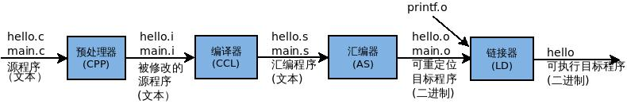
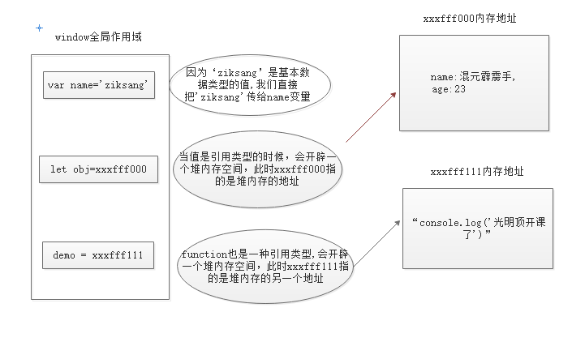
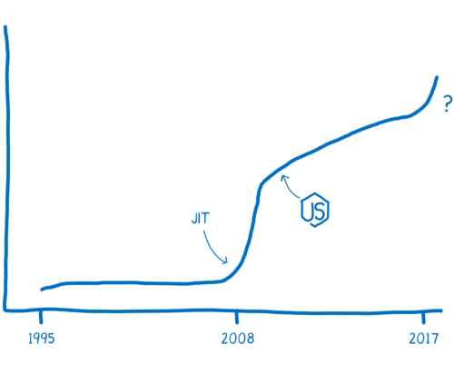

# 前言

最近看的很多知识都在谈论编译和运行这个事情,对于前端JavaScript和Java、C 语言编译和运行会涵盖的那些分别,我试着总结一下.

<!-- more -->

## 编译型

「编译」（compile）是软件系统的一个非常非常重要的概念；很可惜，在 python / ruby / javascript 等解释型语言大行其道的当下，很多人已经不知道编译为何物。当然，即便你使用 c / go / java 等编译型语言，有多少人又真正清楚「编译」究竟是个什么过程呢？
在 wikipedia，compile / compiler 的解释如下：

> A compiler is a computer program (or a set of programs) that transforms source code written in a programming language (the source language) into another computer language (the target language), with the latter often having a binary form known as object code.[1] The most common reason for converting source code is to create an executable program.

**Compiler** 的概念是 计算机程序把 某个在编码语言上的源代码转换成机器语言 (目标语言), 这种转换是为了生成机器码（如 c / go），或者 byte code（java / c#），方便机器执行（byte code 会进一步以 JIT 的方式 compile 成机器码）。

### 编译流程

比如像高级C语言和Java这类语言的编译过程,一般可编译的语言分为四个部分执行编译到运行,会经过 预处理, 编译, 汇编, 链接, 四个部分得出 可执行的目标程序.

| 顺序 | 编译流程               |
| ---- | ---------------------- |
| 1    | 源代码                 |
| 2    | 中间表示形式(中间语言) |
| 3    | 基本操作序列(汇编语言) |
| 4    | 生成最终动作(机器码)   |
| 5    | 运行                   |

前面四个部分都是编译部分.

## 解释型

> An interpreted language is a programming language for which most of its implementations execute instructions directly, without previously compiling a program into machine-language instructions. The interpreter executes the program directly, translating each statement into a sequence of one or more subroutines already compiled into machine code.

**Interpreted** 的概念是 大部分它的工具可以直接执行指令的,没有预先编译程序成机械语言模块.解释型直接执行程序,转换每个声明成一个或者多个已经编译成机器在码的顺序子程序.

引用知乎作者：pansz 一段话

> 对 C 语言或者其他编译型语言来说，编译生成了目标文件，而这个目标文件是针对特定的 CPU 体系的，为 ARM 生成的目标文件，不能被用于 MIPS 的 CPU。这段代码在编译过程中就已经被翻译成了目标 CPU 指令，所以，如果这个程序需要在另外一种 CPU 上面运行，这个代码就必须重新编译。对于各种非编译型语言（例如python/java）来说，同样也可能存在某种编译过程，但他们编译生成的通常是一种『平台无关』的中间代码，这种代码一般不是针对特定的 CPU 平台，他们是在运行过程中才被翻译成目标 CPU 指令的，因而，在 ARM CPU 上能执行，换到 MIPS 也能执行，换到 X86 也能执行，不需要重新对源代码进行编译。

> 至于为什么会有虚拟机的存在？这个答案也很简单了，因为那些非编译型语言生成的并不是目标平台的代码，而是某种中间代码。而能够运行这种中间代码的机器并不广泛存在，所以我们在每个不同的平台中用软件模拟出这个假想平台的虚拟机，这个虚拟机执行这种中间代码，而虚拟机负责把代码转换成最终的目标平台上的指令。

### JavaScript的解释型编译

> "JavaScript is a high-level, dynamic, untyped interpreted programming language”
> JavaScript 是一种高级动态, 弱类型的轻量级解释型程序语言,或是JIT编译型的程序设计语言,它不同于java或C#等编译性语言,它不需要进行编译成中间语言,而是由浏览器或者服务器进行动态地解析与执行。

JavaScript 分成两部分动态解释执行环境.

### 运行在客户端

客户端的 JavaScript 通过提供控制浏览器及其文档对象模型（DOM）的对象来扩展语言核心。例如：客户端版本直接支持应用将元素放在HTML表单中并且支持响应用户事件比如鼠标点击、表单提交和页面导航。
JavaScript 会运行在客户端的浏览器上面,最出名的运行引擎就 Google Chrome 是V8.

### 运行在服务器

服务端的 JavaScript 则通过提供有关在服务器上运行 JavaScript 的对象来可扩展语言核心。例如：服务端版本直接支持应用和数据库通信，提供应用不同调用间的信息连续性，或者在服务器上执行文件操作。

### 解释流程

JavaScript解释型语言会经过以下几个步骤:

**源代码===>预解释(声明->定义)===>执行===>结束**

看着像简单了很多但是解释运行效率会降低了不少.就像知乎上某大神说的.

> 它们就像煮菜,编译是煮好一整餐桌,一起吃,而解释就像打火锅,烫一块吃一口.

而且预解释里面涵盖了大量步骤,如果展开预解释的步骤如下:

**源代码===>预解释(读入代码块->语法分析->声明预处理->定义赋值)===>执行(继续运行下一个代码块)===>结束**

预解释其实是一个编译过种，详细展开一下：

1. **分词/词法分析**: 将一连串字符打断成有意义的片段，称为 token.

2. **解析**: 将 token 的流 (数组) 转换为一个嵌套元素的树，综合地表示程序语言结构，这棵树称为 "抽象语法树" (AST)

3. **代码生成**: 将这个抽象语法树转换为可执行的代码. 生成的可执行代码根椐目标平台，而有不同

| 顺序 | 预解释流程   |
| ---- | ------------ |
| 1    | 词法分析     |
| 2    | 解析         |
| 3    | 生成执行代码 |

在预解释步骤会有很多的考点和知识点影响到你JavaScript的运行与编译,特别在面试的时候也会出现,如果大家如果想更深入了解JavaScript的预解释时候内存处方可以看我的另一篇文章.
[JavaScript 的存储方式]()

JavaScript引擎是严格按着作用域机制（scope）来执行的。JavaScript语法采用的是词法作用域 （lexcical scope），也就是说JavaScript的变量和函数作用域是在定义时决定的，而不是执行时决定的，由于词法作用域取决于源代码结构，所以 JavaScript解释器只需要通过静态分析就能确定每个变量、函数的作用域，这种作用域也称为静态作用域（static scope）。

JavaScript引擎通过作用域链（scope chain）把多个嵌套的作用域串连在一起，并借助这个链条帮助JavaScript解释器检索变量的值。这个作用域链相当于一个索引表，并通过编号来存 储它们的嵌套关系。当JavaScript解释器检索变量的值，会按着这个索引编号进行快速查找，直到找到全局对象（global object）为止，如果没有找到值，则传递一个特殊的undefined值。

如果函数引用了外部变量的值，则JavaScript引擎会为该函数创建一个闭包体（closure），闭包体是一个完全封闭和独立的作用域，它不会在函数调用完毕后就被JavaScript引擎当做垃圾进行回收。闭包体可以长期存在，因此开发人员常把闭包体当做内存中的蓄水池，专门用来长期保存变量的值。只有当闭包体的外部引用被全部设置为null值时，该闭包才会被回收。当然，也容易引发垃圾泛滥，甚至出现内存外溢的现象。

## 编译型和解释型的区别

1, 编译型语言在编译过程中生成目标平台的指令，解释型语言在运行过程中才生成目标平台的指令.

2, 虚拟机的任务是在运行过程中将中间代码翻译成目标平台的指令.

3, 编译型编译的时候编译器会把源文件处理一遍,生成一个目标文件.

4, 解释型就是边处理源文件边执行.

编译型和解释型语言的不同指出只是在于，这些过程发生的时机不一样。编译型语言的代表是C，源代码被编译之后生成中间文件（.o和.obj），然后用连接器和汇编器生成机器码，也就是一系列基本操作的序列，机器码最后被执行生成最终动作。解释型的语言以Ruby为例，也经历了这些步骤，不同的是，C语言会把那些从源代码“变”来的基本操作序列（保存）起来，而Ruby直接将这些生成的基本操作序列（Ruby虚拟机）指令丢给Ruby虚拟机执行然后产生动作了。所以我们看到的现象是，编译型语言要先编译再运行，而解释性语言直接“运行”源代码。

# 即时编译器JIT

为了摆脱解释器的重复翻译的低效行为，浏览器开始将编译器混入其中。
不同的浏览器有着不同的实现，但是基本思想都是一样的。他们会给 They added a new part to the JavaScript 引擎添加一个新的部分叫做监视器（也称之为分析器）。监视器会观察这些代码的运行，然后记录这些代码运行的次数以及他们使用的类型。如果其中一行代码运行了几次，这段代码称之为温和的，如果它运行了很多次，那么它被称之为激烈的。
当一个函数开始变得温和起来，JIT 会将它发送至编译器，然后将编译结果储存下来。以加快JavaScript的运行速度。

JIT 总结来说，它是通过监测运行的代码并将运行频率高的的代码拿去优化来加快 JavaScript 的运行速度。这使得大多数 JavaScrip 的应用程序的性能成倍地提高。就算有了这些提升，JavaScript 的性能也是难以预计的。

# 延伸文章

- 谈谈编译和运行 [文章](https://zhuanlan.zhihu.com/p/20691721)

- 从源代码到可执行文件——编译全过程解析 [文章](http://lxwei.github.io/posts/262.html)

- 理解JavaScript的编译过程与运行机制 [文章](https://my.oschina.net/ffwcn/blog/209465)

- 程序的编译与解释有什么区别?[文章](https://www.zhihu.com/question/21486706)

- javascript运行机制之执行顺序详解 [文章](http://www.imooc.com/article/9009)

- 扒一扒JavaScript 预解释 [地址](https://www.ctolib.com/topics-68359.html)

- 快速了解即时编译器 (JIT) ★ Mozilla Hacks – the Web developer blog [地址](http://www.zcfy.cc/article/a-crash-course-in-just-in-time-jit-compilers-x2605-mozilla-hacks-8211-the-web-developer-blog-4078.html)
