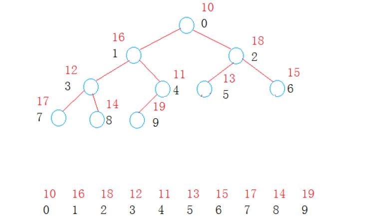
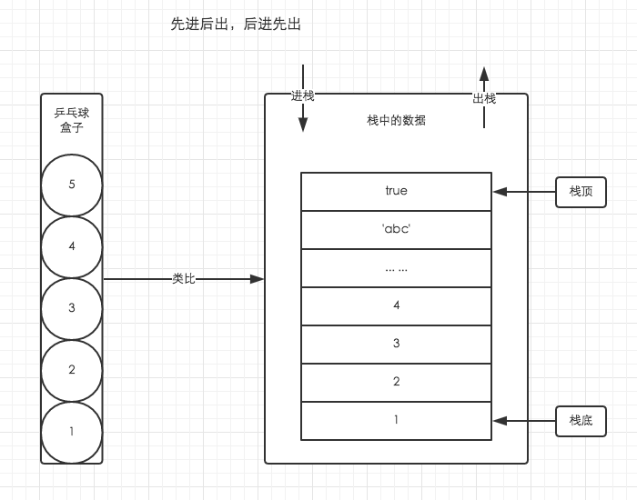
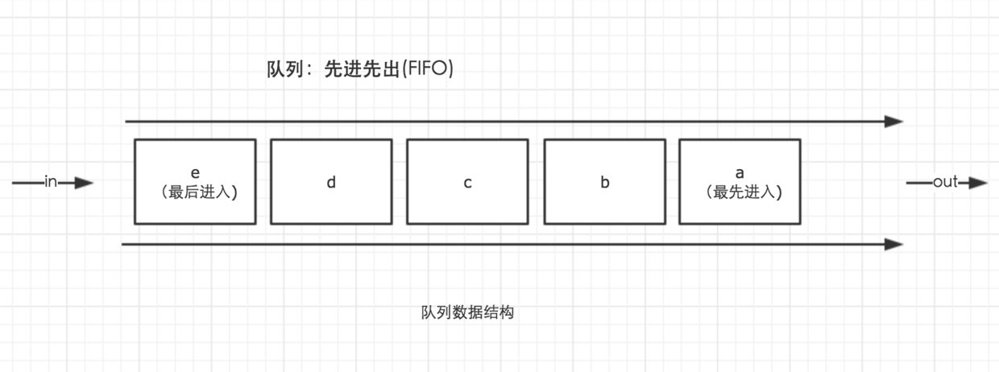
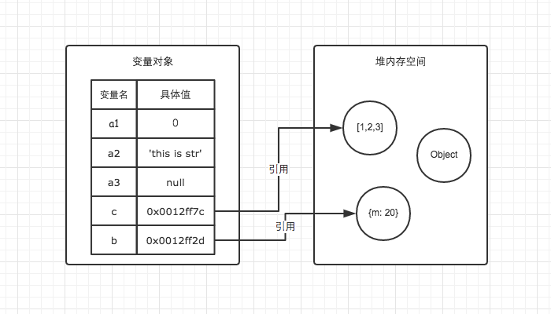
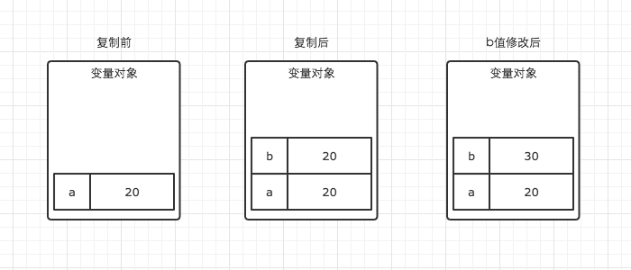
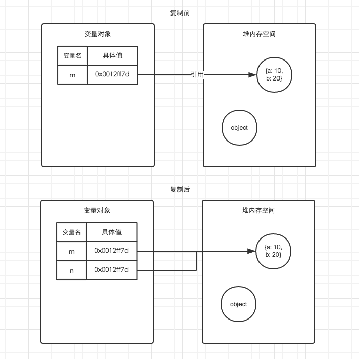

# 前言

[原文链接：http://www.jianshu.com/p/996671d4dcc4](http://www.jianshu.com/p/996671d4dcc4)

最近看到一个面试题 是这样的

```
// demo01.js
var a = 20;
var b = a;
b = 30;

// 这时a的值是多少？
```

```
// demo02.js
var m = { a: 10, b: 20 }
var n = m;
n.a = 15;

// 这时m.a的值是多少？
```

demo01 a = 20
demo02 m.a = 15

这是不是很奇怪, demo01 复制的时候不会受到影响, demo02 的复制影响到了属性.这考虑深一点其实是在考浅拷贝和深拷贝的问题,不过这一切得从JavaScript 内存结构开始说起.
不过在说JavaScript内存之前要补一下内存的三个概念, **堆(heap),栈(stack),队列(queue)**

<!-- more -->

# 内存

与C/C++不同，JavaScript中并没有严格意义上区分栈内存与堆内存。因此我们可以简单粗暴的理解为JavaScript的所有数据都保存在堆内存中。但是在某些场景，我们仍然需要基于堆栈数据结构的思维来实现一些功能，比如JavaScript的执行上下文（关于执行上下文我会在下一篇文章中总结）。执行上下文的执行顺序借用了栈数据结构的存取方式。(也就是后面我们会经常提到的函数调用栈)。因此理解栈数据结构的原理与特点十分重要。下面给出概念.

## 堆Heap

堆的WIKI定义

> 堆（英语：Heap）是计算机科学中一类特殊的数据结构的统称。堆通常是一个可以被看做一棵树的数组对象。在队列中，调度程序反复提取队列中第一个作业并运行，因为实际情况中某些时间较短的任务将等待很长时间才能结束，或者某些不短小，但具有重要性的作业，同样应当具有优先权。堆即为解决此类问题设计的一种数据结构。堆的实现通过构造二叉堆（binary heap），实为二叉树的一种；

可以看一下,下面这图.

这是一个堆的保存结构图,这会很像一棵树,但再看一下下面数列,其实是一个数组.键值对应数值,一个KEY 对应一个Value,与书架与书非常相似。书虽然也整齐的存放在书架上，但是我们只要知道书的名字，我们就可以很方便的取出我们想要的书，而不用像从乒乓球盒子里取乒乓一样，非得将上面的所有乒乓球拿出来才能取到中间的某一个乒乓球。好比在JSON格式的数据中，我们存储的key-value是可以无序的，因为顺序的不同并不影响我们的使用，我们只需要关心书的名字。

## 栈Stack

栈的WIKI定义

> 堆栈（英语：stack）又称为栈或堆叠，是计算机科学中一种特殊的串列形式的数据结构，其特殊之处在于只能允许在链接串列或阵列的一端（称为堆叠顶端指标，英语：top）进行加入数据（英语：push）和输出数据（英语：pop）的运算。栈根据(LIFO Last IN First Out) 原理运作.

最简单的理解就是乒乓球盒子可以看下图


图中的乒乓球盒子就可以看作是栈最先放进的1号玩只能是最后一个拿出.

## 队列Queue

队列Wiki的定义

> 队列，又称为（queue），是先进先出（FIFO, First-In-First-Out）的线性表。在具体应用中通常用链表或者数组来实现。队列只允许在后端（称为rear）进行插入操作，在前端（称为front）进行删除操作。队列的操作方式和堆栈类似，唯一的区别在于队列只允许新数据在后端进行添加。

队列是一种先进先出（FIFO）的数据结构。正如排队过安检一样，排在队伍前面的人一定是最先过检的人。用以下的图示可以清楚的理解队列的原理。



队列存储方式一般使用在,事件序列里面.

# JavaScript内怎样保存数据.

引用**这波能反杀**等等神上面的一段话:

> 严格意义上来说，变量对象也是存放于堆内存中，但是由于变量对象的特殊职能，我们在理解时仍然需要将其于堆内存区分开来。

我们再回顾一下JavaScript有那些基本变量

一.基本数据类型
1.number
2.string
3.boolean
4.null
5.undefined

基础数据类型都是一些简单的数据段，JavaScript中有5中基础数据类型，分别是Undefined、Null、Boolean、Number、String。基础数据类型都是按值访问，因为我们可以直接操作保存在变量中的实际的值。

二.引用数据类型
1.object ---- {}对象 ---- []数组 ---- /^$/正则 ---- Date时间
2.function

与其他语言不同，JS的引用数据类型，比如数组Array，它们值的大小是不固定的。引用数据类型的值是保存在堆内存中的对象。JavaScript不允许直接访问堆内存中的位置，因此我们不能直接操作对象的堆内存空间。在操作对象时，实际上是在操作对象的引用而不是实际的对象。因此，引用类型的值都是按引用访问的。这里的引用，我们可以理解为保存在变量对象中的一个地址，该地址与堆内存的实际值相关联。

为了更好的搞懂变量对象与堆内存，我们可以结合以下例子与图解进行理解。

```javascript
var a1 = 0; // 变量对象
var a2 = "this is string"; // 变量对象
var a3 = null; // 变量对象

var b = { m: 20 }; // 变量b存在于变量对象中，{m: 20} 作为对象存在于堆内存中
var c = [1, 2, 3]; // 变量c存在于变量对象中，[1, 2, 3] 作为对象存在于堆内存中
```



其实不难看出基本类型的JavaScript 变量会保存在栈里面, 堆会保存引用类型的数据.
因此当我们要访问堆内存中的引用数据类型时，实际上我们首先是从变量对象中获取了该对象的地址引用（或者地址指针），然后再从堆内存中取得我们需要的数据。
好了现在我们基本理解JavaScript保存数据的状态,我们再看回之前一开始的DEMO1和DEMO2

```javascript
// demo01.js
var a = 20;
var b = a;
b = 30;

// 这时a的值是多少？
```

```
// demo02.js
var m = { a: 10, b: 20 }
var n = m;
n.a = 15;

// 这时m.a的值是多少
```

在变量对象中的数据发生复制行为时，系统会自动为新的变量分配一个新值。var b = a执行之后，a与b虽然值都等于20，但是他们其实已经是相互独立互不影响的值了。具体如图。所以我们修改了b的值以后，a的值并不会发生变化。



在demo02中，我们通过var n = m执行一次复制引用类型的操作。引用类型的复制同样也会为新的变量自动分配一个新的值保存在变量对象中，但不同的是，这个新的值，仅仅只是引用类型的一个地址指针。当地址指针相同时，尽管他们相互独立，但是在变量对象中访问到的具体对象实际上是同一个。如图所示。

因此当我改变n时，m也发生了变化。这就是引用类型的特性。



这就很容易理解了.

# 存放栈和堆的对比

| 栈内存                 | 堆内存                       |
| ---------------------- | :--------------------------- |
| 存储基础数据类型       | 存储引用数据类型             |
| 按值访问               | 按引用访问                   |
| 存储的值大小固定       | 存储的值大小不定，可动态调整 |
| 由系统自动分配内存空间 | 由程序员通过代码进行分配     |
| 主要用来执行程序       | 主要用来存放对象             |
| 空间小，运行效率高     | 空间大，但是运行效率相对较低 |
| 先进后出，后进先出     | 无序存储，可根据引用直接获取 |

# 延伸阅读

- 前端基础进阶（一）：内存空间详细图解 -- 作者:这波能反杀 [地址](http://www.jianshu.com/p/996671d4dcc4)

- 光明顶开课了 JAVAscript 第一课（预解释） [地址](https://juejin.im/post/591c40dd0ce463006919bb02)

- 前端基础进阶：详细图解 JavaScript 内存空间 掘金[地址](https://juejin.im/entry/589c29a9b123db16a3c18adf)
