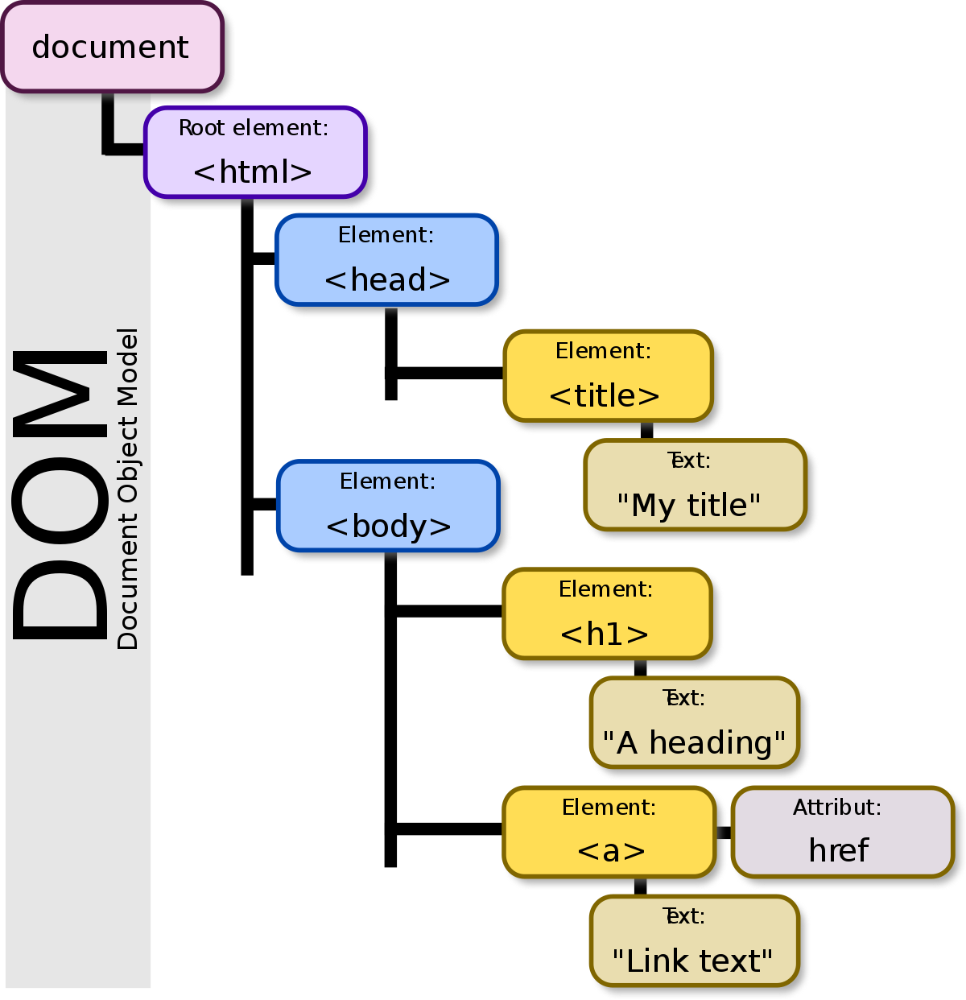

# DOM

DOM 是针对 HTML 和 XML 文档的一个 API应该程序编程接口。DOM 用来描绘了一个可添加、移除和修改的层次的节点树。DOM 是由 DHTML (动态 HTML)开始创立的，现在都是跨平台、语言中立的。

DOM 是一个树形结构的根节点集合组成的。

<!-- more -->

## 1. Node 类型

DOM1 级里面定义了一个 Node 接口, 所有节点类型都继承自 Node 类型, 所有的节点类型都有着相同的基本属性和方法。


| Node 常量数值  | Node 节点类型      |
|----|-----------------------------|
| 1  | ELEMENT_NODE                |
| 2  | ATTRIBUTE_NODE              |
| 3  | TEXT_NODE                   |
| 4  | CDATA_SECTION_NODE          |
| 5  | ENTITY_REFERENCE_NODE       |
| 6  | ENTITY_NODE                 |
| 7  | PROCESSING_INSTRUCTION_NODE |
| 8  | COMMENT_NODE                |
| 9  | DOCUMENT_NODE               |
| 10 | DOCUMENT_TYPE_NODE          |
| 11 | DOCUMENT_FRAGMENT_NODE      |
| 12 | DOCUMENT_NOTATION_NODE      |


### 1. `nodeType` Node节点的类型

`nodeType` 可以用来显示当前 Node节点类型。判断的时候可以用类型 `Node.ELEMENT_NODE`  或者常量数值也行，最好使用常量数值进行比较为了确保浏览器兼容。

```javascript
    if (someNode.nodeType === Node.ELEMENT_NODE) // 用来判断 Element 节点
    // or
    if (someNode.nodeType === 1 ) // 用来判断 Element 节点
```

### 2. `nodeName` Node节点的元素标签名

```javascript
    var element = document.getElementByID("testName")
    console.log(element.nodeName) // "DIV"
```

### 3. `nodeValue` Node节点元素的值

对于元素节点 `nodeName` 中保存的是元素的标签名，而 `nodeValue` 值为 null 。


### 1. NodeList

在 DOM 中每个节点都存在一个`childNodes`的属性, `childNodes` 属性保存的是 NodeList 的对象， NodeList 对象是一个拥有 length 属性的类数组，并不是一个真正的数组。 DOM 的结构变化能自动反映在 NodeList 对象中的， NodeList 是一个动态的对象。

如果想访问，NodeList 元素可以使用下面的方法:
```javascript
    //1
    var firstChild = someNode.childNodes[0] // 使用数组标，因为更贴近数组，所以更多开发人员在使用
    //2
    var secondCHild = someNode.childes.item(1) // 使用 item（）方法
```

或者把 NodeList 转变为数组

```javascript
    // 转换数组
    function convertToArray(nodes){
        var array = null
        try { // 通过 try catch 来捕获错误
            array = Array.prototype.slice.call(nodes, 0) // 非 IE8以下浏览器
        } catch(ex) {
            array = new Array()
            for(var i = 0, len = nodes.length; i < len; i++){
                array.push(nodes[i])
            }
        }
        return array
    }
```

### 2. 关于 parentNode 属性和 previousSibling、nextSibling属性。


一图解释全部关系 Node 节点下面的子节点，有一个 `parentNode` 属性对回父类属性，如果 `nextSibling` 和 `previousSibling` 为最尾或者最头节点会返回 `null`。

`someNode.ownerDocument` 每个节点都有这个属性，指向最顶层的 HTML 节点。
`someNode.hasChildNodes()` 返回该节点是否有 childNodes。

### 3.操作节点

1. `appendChild()` 在指定的节点 childNodes 内追加一个元素节点在 childNodes 末尾。

`someNode.appendChild(someELement)` 添加子节点到 someNode 的 childNodes 最后面。如果节点已经存在在节点树中那么，就会从原来的位置移动到操作后的位置。

2. `insertBefore(newNode, someNode)` 把 newNode 插入到 someNode 节点之前。

如果传入的第二个参数为 `null` 则会和 `appendChild()` 操作效果一样。

3. `replaceChild(newNode, someNode)` 用 newNode节点把 someNode 节点替换了，`replaceChild` 可以删除节点。

4. `removeChild()` 移除节点

```javascript
    var formerFirstChild = someNode.removeChild(someNode.firstChild) // 移除第一个子节点
```
删除和移除节点后，节点并不是消失了，只是不在 DOM 树中，如果需要彻底删除需要 `formerFirstChild = null`,释放节点那么引用节点的事件才会跟着释放内存。

5. `cloneNode()` 创建复制副本

```javascript
    var deepList = myList.cloneNode(true) // 深度拷贝
    console.log(deepList.childNodes.length) // 3
    var shalloList = myList.cloneNode(false) // 浅拷贝
    console.log(shallowList.childNodes.length) // 0
```

## Document 类型

Document 代表整个文档。document 对象是 window对象的一个属性。

```javascript
    console.log(window.document.nodeType) // 9
    console.log(window.document.nodeName) // #document
    var html = document.querySelector("html") // 获取 html
    console.log(html.parentNode.nodeType) // 9 html的父类就是 document 节点
    console.log(document.parentNode) // document 的父类为 null
    console.log(document.childNodes) // NodeList(2) [<!DOCTYPE html>, html.module-default] 
```

对于 document 的直接子元素属性可以直接属性访问
```javascript
    console.log(document.doctype) // <!DOCTYPE html>
    console.log(document.doctype.nodeType) // 这能获得 10  DOCUMENT_TYPE_NODE 值
    console.log(document.body) // <body id="body" style>...</body>
    console.log(document.title) // 标题
```

document 里面还自带了，几个 BOM 对象属性非常实用
```javascript
    console.log(document.URL) // 取得连接
    console.log(document.domain) // 取得域名
    console.log(document.location) // 获得地址信息
    console.log(document.images) // 同样这方法也能获取全部文档 img 元素的节点
    console.log(document.anchors) // 包含文档中所有带 name 特性的 <a> 元素
    console.log(document.forms) // 包含文件中所有 <form> 元素
```


### 检测 DOM 的功能类型

可以通过 `document.implementation.hasFeature` 来判断是否包含 Dom 的部分功能。
```javascript
    var haxXmlDom = document.implementation.hasFeature("XML","1.0") 
```

### DOM写入流

除了操作 DOM 方法外，还可以使用写入流来插入 node 元素节点。有以下几个方法

1. `write()` 方法，把传入的字符串写入到 dom 流中。

```javascript
    document.write("<strong>" + (new Date()).toString() + "</strong>")
```

2. `writeln()` 方法，把传入的字符串写入到 dom 流中并最后换行。
3. `open()` 方法，用于打开写入流。页面加载其间不需要使用这方法。
4. `close()` 方法，用于关闭写入流。页面加载其间不需要使用这方法。


### 查找元素的方法

- `document.getElementById()` 通过节点 id 属性查找 ELement 节点,返回 ELEMENT_NODE
```javascript
var div = document.getElmentById('myDiv')
```

- `document.getElementsByTagName()` 通过元素的标签名返回找到的元素列表 HTMLCollection
```javascript
var images = document.getELementsByTagName("img")
// 访问 HTMLCollection 方法
console.log(images.length) // 图像数量
console.log(images[0]) // 数组访问
console.log(images.item(0)) // item 形式访问
console.log(images.namedItem('myImage')) // 访问 name 属性为 myImage 的元素
var allElements = document.getElementsByTagName("*") // 获取所有元素

```

- `document.getElementsByName` 通过元素的 name 特性，返回 HTMLCollection

通常会使用在单选按钮上面，获取同一类组别的元素。


### 创建元素节点

1. `createElement()`创建元素节点
2. `createComment` 创建解释节点


## Element 类型

Element 是 Web 编程中最常用的类型，用于表现 XML 或 HTML 元素，提供对元素的标签名，子节点特性访问等。

在Element的 `nodeName` 属性中，保存的是元素标签名, `nodeValue` 返回的是 null。


### 关于 Element 和 Node 的区别

很多人都会混淆了 Element 和 Node 的区别，其实两个是完全不一样的东西，Node 是属于 HTML DOM 中的基类，所有像 Element ,Attribut Text,都是 Node 的实例对象，
是特殊的 Node 分别叫做， Element_Node, Text_Node, Comment_Node , 所以 Element_Node 都会继承 Node 的属性。

### NodeList vs HTMLCollection

- NodeList 是由 Node 类型组成的列表
- HTMLCollection 是由 Element 节点组成的列表，操用 DOM 的时候都会操作 ElementList 即是 HTMLCollection ，而不会去操作 NodeList。
- 特别要注意的是 NodeList 和 HTMLCollection 都不是真正的数组，都是类数组。
- NodeList 会包含文本节点和空格节点
- NodeList 和 HTMLCollection 都是 live 的，会动态变化。
- NodeList 没有 nameditem() 方法，而 HTMLCollection 有。

### 怎样获取 NodeList 和 HTMLCollection

```javascript
    // 获取 HTMLCollection
    const div = document.getElementById('Id') // HTMLCollection
    document.getElementsByName('Name') // HTMLCollection
    document.getElementsByTagName('TagName') // HTMLCollection
    document.getElementsByClassName('style') // HTMLCollection

    document.querySelectorAll('style') // 返回的是 nodelist,但是实际上的是 元素集合，并且是静态的

    div.item(0) // HTMLCollection 可以通过 item 方法访问单独 node 节点
    div[0] // HTMLCollection 也可以通过直接数组的形式访问

    node.childNodes // 返回 NodeList 
    div.item(0).childNodes // 返回 NodeList 
```

### Element 的属性

所有 HTML 元素都是由 HTMLElement 类型来表示的，HTMLElement 是直接继承自 Element 一些属性包括:

- id
- className
- title
- lang
- name
- ref

访问的时候可以直接获得一个node节点，再直接访问属性
```javascript
    var div = document.getElementById('myDiv')
    div.id
    div.className
    div.lang
    div.ref
```

或者可以使用 dom 方法来操作属性值

```javascript
    var div = document.getElementyById('myDiv')
    div.getAttribute('id')
    div.setAttribute('id',value)
```

有三种操作特性的方法

```javascript
    div.getAttribute('id') // 获取 属性 ID 的值
    div.setAttribue('id',value) // 设置 ID 的值
    div.removeAttribute('id') // 删除 ID 的属性
    // attributes 属性
    element.attributes.lenght // 通过 Element_node 的 attributes 属性访问
```

### 创建元素

创建元素节点可以通过下面方法创建
```javascript
    // 传参数是 tagName
    var div = document.createElement('div')
    // or
    var div = document.createElement("<div id=\"myNewDiv\" class=\"box\"></div>")
```

创建元素节点后是单独存在的，还需要添加到文档树中，才会在页面显示出来。
```javascript
    node.appendChild() // 在末尾添加子节点
    node.insertBefore() // 在某节点前添加子节点
    node.replaceChild() // 替换子节点
```

## Text 类型

文本节点由 Text 类型表示，是用来保存纯文本的内容，一般包含在 Element 节点里面。

```javascript
    <div></div> <!--没有文本节点-->
    <div> </div><!--空格也算文本节点-->
    <div>Hello World!</div> <!--文本节点-->
```

文本节点可以直接通过 `nodeValue` 赋值,不过记着是要对 TextNode 的 `nodeValue` 赋值,别对其它 Node 节点赋值是没什么作用的，比如 ElementNode。
```javascript
    const head = document.getElementById('head')
    head.childNodes[0].nodeValue = 'Text_Node'
```
### 创建文本节点

```javascript
    var element = document.createElmenet('div')
    var textNode = document.createTextNode('<strong>Hello</strong> World!')
    element.appendChild(textNode)
    document.body.appendChild(element)
```

### Text类型节点的方法

- normalize() 能把元素节点下多个文本子节点合并
- splitText() 能把文本子节点分拆，正好和 normalize 相反

## Comment 类型

注释节点，注释节点是通过 Comment 来表示。

## CDATASection 类型

用于针对基于 XML 的文档描述

## DocumentType 类型

用于描述页面整个文档的 doctype 有关信息

## DocumentFragment 类型

用于包含document 片块节点信息

## Attr 类型

用来表示元素节点里面的属性，属性都由 AttrNode 节点表示。
操作属性节点的方法有：

```javascript
    node.getAttribute('name') // 获取 属性节点
    node.setAttribute('name','value') // 更改属性节点
    node.removeAttribute('name') // 移动属性节点

    document.createAttribute('align') // 创建属性节点
```

### 动态脚本

有了上面操作 DOM 的操作方法，就可以动态地做很多事情比如说动态加载脚本

```javascript
    const script = document.createElmenet('script') // 创建元素节点
    script.type = 'text/javascript' // 设置忏悔
    script.src = 'client.js'
    script.appendChild( // 在脚本里面添加 sayHi 方法
        document.createTextNode(" 
            function sayHi()(
                console.log('hi')
            )
        ")
    )
    document.body.appendChild(script) // 添加到文档树中
```

### 动态样式

同样也能添加动态样式
```javascript
    const link = document.createElement('link')
    link.rel = 'stylesheet'
    link.type = 'text/css'
    link.appendChild(document.createTextNode("body{background-color:red}"))
    link.href = 'style.css'
    let head = document.getElementsByTagName('head')[0]
    head.appendChild(link)
```

### 关于 NodeList 的使用

NodeList 、NamedNodeMap、 HTMLCollection 三个集合都是动态变化的，每当文档结构发生变化的时候，它们都会更新 live 状态。所以在遍历操作 NodeList 的时候得小心，最好把 NodeList.length 单独赋变量，以至不会让更改 NodeList 的时候无限变化。DOM 操作会花费比较大的资源，访问 NodeList 都会运行一次查询，尽量减少 DOM 操作会比较好。


# DOM Level

## DOM

DOM(文档对象模型) 是针对 HTML 和 XML 文档的一个API(应用程序编程接口)，DOM 描绘了一个层次化的节点树，允许开发人员添加、移除和修改页面的某一部分。DOM 定义了访问 HTML 和 XML 文档的标准，可以允许脚本动态地更新文档内容、结构和样式, 简单点说就是提供一个文档对象模型给 JS 动态修改文档状态。 DOM 是一个共 W3C 公发布的标准，所以可以在所有浏览器上使用 DOM 的这些 API。



## 浏览器渲染


这图很清楚地描述了整个页面渲染过程，而 DOM 标准是基于 HTML 上解释成文档对象模型，之后再和 CSS 树合并，画出来的。

## DOM 的发展史

### DOM | DOM0

最初 DOM 还没有被标准化，还只是在 Netscape Navigator3 上的模型，结果 IE3 和 Netscape Navigator3 上的模型都各自不同，相互冲突，那个时候被叫 DOM Level 0。

### DOM 1

在浏览器各厂商进行大战的同时，W3C 结合大家的优点推出了一个标准化的 DOM ，被叫为 DOM1。 DOM1 被定义为一个与平台和编程语言无关的接口，可以通过这些 API 接口访问和修改文档的内容、结构和样式。DOM1 是比较基础的，主要定义了 HTML 和 XML 文档的底层结构，DOM1 由三部分组成，包括: 核心 (core)、 HTML接口。

- DOM Core （DOM 核心）：DOM Core 规定了基于 XML 的文档结构标准，通过这个标准简化了对文档中 XML 的访问和操作。

- DOM HTML ：DOM HTML 则在 DOM 核心的基础上加以扩展，添加了针对 HTML 的对象和方法。

### DOM 2
DOM2 在 DOM1 的基础上引入了更多的交互能力，支持更高级的 XML 特性。 DOM2 扩充了，鼠标、用户界面事件、范围、遍历等细分模块，而且增加了对 CSS 的支持。

* DOM2核心(DOM2 Core): 为节点添加更多方法和属性。
* DOM级视图(DOM2 HTML): 在 DOM1 上添加更多属性、方法和新接口。
* DOM视图 (DOM2 Views): 为文档定义了基于样式信息的不同视图。
* DOM事件 (DOM2 Events): 说明了如何使用事件与 DOM 文档交互。
* DOM样式 (DOM2 Style): 定义了如何方式访问和改变 CSS 样式的信息。
* DOM遍历和范围 (DOM2 Traversal and Range): 引入了遍历 DOM 文档和选择其特定部分的新接口。

DOM2 样式，围绕外部样式表，`<style/>`样式表，和针对特定元素的样式，提交API。

#### `style`
利用节点的 style 属性，可以访问任何该节点元素的样式信息。
```javascript
    // 可以直接对 Node_Element 节点的 style属性进行添加样式
    const myDiv = document.getElementById('myDiv')
    myDiv.style.backgroundColor = 'red'
    myDiv.style.width = '100px'
    myDiv.style.border = '1px solid black'

    // 还可以直接设置 style.cssText,直接设置能大量修改样式特性
    myDiv.style.cssText = 'width: 25px; height: 100px; background-color: green;'

    //访问 style 的时候和访问 Node 节点一样
    for(const i = 0 ,len=myDiv.style.length; i < len; i++) {
        const divStyle =  myDiv.style[i] // 数组形式访问， 获取 CSS 属性名
        const divItemStyle = myDiv.style.item(i) // item函数访问, 获取 CSS 属性名
        // 通过 getPropertyValue 获取属性的值
        const value = myDiv.style.getPropertyValue(divStyle)
        // 如果访问cssText
        const value = myDiv.style.getPropertyCSSSValue(prop)
    }
    // 删除style属性
        myDiv.style.removeProperty('border')
```

#### `getComputedStyle()`

利用 `getComputedStyle()` 能计算出从其他样式表层叠而来影响到当前元素的样式信息。

```javascript
const myDiv = document.getElementById('myDiv')
// 传入两个参数， Node 节点，伪元素字符串（没有可以传 null 
// 计算出这个元素的最终样式
const computedStyle = document.defaultView.getComputedStyle(myDiv, null)
computedStyle.backgroundColor // "red"
computedStyle.width // "100px"
computedStyle.height // "200px"
computedStyle.border 
```

#### `document.styleSheets` && `sheet.cssRules` && `sheet.rules`

`document.styleSheets`可以返回当前文档的样式表集合。
`sheet.cssRules` 和 `sheet.rules` 可以访问样式元素里面的 CSS 元素。
```javascript
    console.log(document.styleSheets) // StyleSheetList {0: CSSStyleSheet, 1: CSSStyleSheet, 2: CSSStyleSheet, 3: CSSStyleSheet, length: 4}

    const sheet = document.styleSheets[0] // 获取文档第一个样式表
    const rules = sheet.cssRules || sheet.rules // 获取样式表里面的 CSS列表
    const rule = rules[0] // 获取第一条
    console.log(rule.selectorText) // "div.box"
    console.log(rule.style.cssText) // "全部css样式"
    console.log(rule.style.backgroundColor) // "blue"
    console.log(rule.style.width) // "100px"
    console.log(rule.style.height) // "200px"

    rule.style.backgroundColor = "red" // 修改样式属性
    sheet.insertRule("body { background-color: sliver }",0) // 在样式表插入样式 在 0 行插入
    sheet.deleteRule(0) // 删除 0 行
    sheet.removeRule(0) // 兼容 IE

```

#### DOM2 偏移量

在日常网页开发中偏移量在经常使用在横福，广告轮转，页面滚动当中啊。理解根本的概念非常重要。

#### offsetParent
`Node.offsetTop` 直接访问距离属性

`Node.offsetParent` 对象可以统一包含下面属性
- **offsetHeight**：元素在垂直方向上占用的空间大小。
- **offsetWidth**： 元素在水平方向 上占用的空间大小。
- **offsetLeft**： 元素的左外边框至包含元素的左内边框之前的像素距离。
- **offsetTop**： 元素的上外边框至包含元素的上内边框之间的像素距离。


#### 客户区大小

客户区大小指元素内容及其内边距所占据的空间大小。

`Node.offsetParent` 对象可以统一包含下面属性
- **clientWidth**: 是元素内容区宽度边距宽度。
- **clientHeight**: 属性是元素内容区高度边距高度。

#### 滚动大小

滚动大小是指包含滚动内容的元素的大小。
- **scrollHeight**: 在没有滚动条的情况下，元素内容的总高度。
- **scrollWidth**: 在没有滚动条的情况下，元素内容的总宽度。
- **scrollLeft**: 被隐藏在内容区域左侧的像素数。通过设置这个属性可以改变元素的滚动位置。
- **scrollTop**: 被隐藏在内容区域上方的像素数。通过设置这个属性可以改变元素的滚动位置。

- **getBoundingClientRect()**: 返回一个矩形对象包含4个属性: left、top、right、bottom.

DOM2 遍历

DOM2 提供了下面两个 DOM 类型来遍历 DOM 结构，这两个类型都是基于深度优先算法遍历的。就是遇到兄弟节点先把兄弟节点遍历到底再遍历另一边的兄弟子点。

- NodeIterator

```javascript
const filter = function(node) {
    return node.tagName.toLowerCase() == 'p' ?
           NodeFilter.FILTER_ACCEPT :
           NodeFilter.FILTER_SKIP
}
const iterator = document.createNodeIterator( // 创建遍历节点
    root, // 从那个父节点开始遍历
    NodeFilter.SHOW_ELEMENT, // 节点数字代码
    filter, // NodeFilter 对象，接受某中特定节点的函数
    false // 在 HTML 页面返回 false
)

iterator.nextNode() // 下一个节点
iterator.previousNode() // 上一个节点
```

- TreeWalker

TreeWalker 和 NodeIterator 使用方式很相似

```javascript
    const div = document.getElementById('div')
    const filter = function(node) {
        return node.tagName.toLowerCase() === "li"?
               NodeFilter.FILTER_ACCEPT :
               NodeFilter.FILTER_SKIP
    }
    const walker = document.createTreeWalker( // createTreeWalker
        div,
        NodeFilter,
        SHOW_ELEMENT,
        filter,
        false
    )
    walker.firstChild() // 第一个节点
    walker.nextSibling() // 下一个字点
    walker.currentNode // 当前的节点
    let node = iterator.nextNode()

    while(node !== null) {
        console.log(node.tagName)
        node = iterator.nextNode()
    }
```

DOM2 中的范围

- createRange()

```javascript
    const range1 = document.createRange() // 创建范围
    const range2 = document.createRange()
    const p1 = document.getELmenetById('p1')
    range1.selectNode(p1) // 选择整个节点，包括其子节点
    range2.selectNodeContents(p1) // 只选择节点的子节点
```

DOM2 范围还有增删查改的操作，不一一详解了。

### DOM 3
DOM3 扩展了 DOM，增加了一些扩展模块：

* DOM3 加载和保存模块(DOM Load and Save): 引入了以统一方式加载和保存文档的方法。
* DOM3 验证模块 (DOM Validation): 定义了难文档的方法
* DOM3 核心的扩展 (DOM Style): 支持 XML 1.0规范，涉及 XML Infoset、XPath 和 XML Base 
* DOM3 事件模块在 DOM2 事件模块上重新定义了这些事件

DOM2 和 DOM3 都不同程度对 XML 命名空间有扩展，比较少使用到就不展开讨论了。

## DOM 接口

DOM 模型的接口有30多个，但常用的只有4~5个

### Document

Document接口是对文档进行操作的入口，它是从Node接口继承过来的。 

### Node
　　Node接口是其他大多数接口的父类。在DOM树中，Node接口代表了树中的一个节点。

### NodeList
　　NodeList接口是一个节点的集合，它包含了某个节点中的所有子节点。它提供了对节点集合的抽象定义，并不包含如何实现这个节点集的定义。NodeList用于表示有顺序关系的一组节点，比如某个节点的子节点序列。在DOM中，NodeList的对象是live的，对文档的改变，会直接反映到相关的NodeList对象中。

### NamedNodeMap
　　NamedNodeMap接口也是一个节点的集合，通过该接口，可以建立节点名和节点之间的一一映射关系，从而利用节点名可以直接访问特定的节点，这个接口主要用在属性节点的表示上。尽管NamedNodeMap所包含的节点可以通过索引来进行访问，但是这只是提供了一种枚举方法，NamedNodeMap所包含的节点集中节点是无序的。与NodeList相同，在DOM中，NamedNodeMap对象也是live的。


# DOM 事件

## DOM 事件流

JavaScript 和 HTML 之间的交互是通过事件实现的。最早的 DOM 事件是在 DOM2开始标准化的。

- DOM2 实现了浏览器事件的基础标准，但没有涵盖所有事件类型。

- DOM3 增加了 DOM事件 API，增加了包含 BOM 的事件操作。


在事件当中，有一个事件流的概念像下图。

<center>
    
</center>

- IE 事件冒泡

IE的事件流叫做 **事件冒泡(event bubbling)**，即触发事件开始时由最里面的元素接收，之后逐级向上传播到最上层节点。像上图从 6 传到 10。

- Netscap 事件捕获

Netscape 团队提出的另一种叫做 **事件捕获(event capturing)**，即角发事件开始从元素的最顶层父节点，一层层向下捕获，直到找到该解发事件的该元素。即上图从 1 捕获到 5。

由于老板本的不支持，因此很相对少人使用事件捕获，一般使用事件冒泡。

DOM2级事件流 包括三个阶段： 事件捕获阶段、处于目标阶段和事件冒泡阶段。

## 事件处理程序

事件处理程序包括事件程序的名字和事件处理程序。

```javascript
// 给元素 input 绑定 onclick 事件
<input type="button" value="Click Me" onclick="showMessage(event, this)">
<script type="text/javascript">
    function showMessage(event, input) { // 定义事件处理程序
        console.log('Hello world!')
        console.log(event) // 事件对象
        console.log(input) // 解发事件的元素本身，可以通过元素本身获取属性。
    }
</script>
```
这样定义处理程序，会创建一个封装着元素属性的函数，函数中会有一个局部变量事件对象 `event`。`this` 是指向当前事件的目标元素。不过这样定义 JavaScript 事件也是有缺点的，就是 HTML 和 JavaScript 代码耦合度很高，如果要更改代码就要更改 HTML 代码和 JavaScript 代码。

## DOM0 级事件处理程序

比事件绑定好的原因是，耦合度低，跨浏览器，脚本就能实现。缺点是：必须要完成加载 JS 脚本，才会有事件效果，不然未加载完成是触发不了事件。

```javascript
    const btn = document.getElementById('myBtn')
    btn.onclick = function() {  // 给 btn 添加 onclick 事件
        console.log('Clicked')
        console.log(this.id) // 'myBtn'
    }
    btn.onclick = null // 删除onclick 事件
```

## DOM2 级事件处理程序

DOM2 定义了两个方法用于处理指定和删除事件处理程序的操作,所有的 DOM 节点中都包含这两个方法，并接受3个参数。

- addEventListener()

```javascript
    const btn = document.getElementById('myBtn')
    btn.addEventListener('click', function() { // 添加 click 事件, 处理事件是匿名函数
        console.log(this.id)
    },false) // false 表示冒泡阶段才调用事件处理程序， true 表示在捕获阶段调用处理程序
```


```javascript
    const btn = document.getElementById('myBtn')
    btn.addEventListener('click', function(){ // 添加 click 事件1
        console.log(this.id)
    }, false)
    btn.addEventListener('click', function(){ // 添加 click 事件2
        console.log('Hello world!')
    }, false)
```
这里添加了两个 click 事件，解发的时候会按添加的顺序触发。

- removeEventListener()

在 `removeEventListener` 中是移除添加的解发事件，但是有一个问题如果是按上面方法，添加匿名函数来触发事件是没办法移除的。像下面例子

```javascript
    const btn = document.getElmentById('myBtn')
    btn.addEventListener('click', function(){
        console.log(this.id)
    },false)
    btn.removeEventListener('click', function(){ // 没有作用
        console.log(this.id)
    },false)
```
可以改成实名函数的方式

```javascript
    const btn = document.getElementById('myBtn')
    const handler = function(){ // handler 事件处理
        console.log(this.id)
    }
    btn.removeEventListener('click', handler, false) // work
```
如果不是特别需要，我们不建议在事件捕获阶段注册事件处理程序。


## IE 事件处理程序

- attachEvent()
- detachEvent()

`attachEvent`、`detachEvent` 和 `addEventListener`、 `removeEventListener` 使用上很像，不过要注意一点 `attachEvent` 上的 `this` 指向的是 `window`,`addEventListener` 指向上的是元素本身。

## DOM 中的事件对象 event

在 DOM0 或者 DOM2级中，绑定事件都会传入 `event` 对象。

```javascript
    // DOM2
    const btn = document.getElementById('myBtn')
    btn.onclick = function(event) {
        console.log(event.type) // 'click'
    }
    btn.addEventListener('click', function(event) {
        console.log(event.type) // 'click'
    }, false)

    // DOM0
    const handleOnClick = function(event) {
        console.log(event.type)
    }
    <input type="button" value="Click Me" onclick="handleOnCLick()" />
```

`event` 几个重要的属性与方法

- `event.eventPhase` 属性判断调事事件处于那个阶段 1 表示捕获阶段 2表示'处于目标'阶段 3 表示冒泡阶段

- `event.preventDefault()` 取消事件默认行为。

- `event.stopImmediatePropagation()` 取消事件的进一步捕获或冒泡，同时阻止任何DOM3事件处理程序被调用

- `event.stopPropgation()` 取消事件的进一步捕获或冒泡

- `event.target` 属性表示为当前事件的触发目标元素。

- `event.currentTarget` 属性为当前事件的注册元素。

- `event.type` 被触发的事件类型

- `event.cancelable` 表示是否可以取消事件的默认行为，如果为 true 则可以取消, false 则没有默认动作，或者不能阻止默认动作。

关于 `event.currentTarget` 和 `event.target` 和 `this` 的区别。

```javascript
    document.body.onclick = function(event) {
        console.log(event.currentTarget) // 注册事件的元素
        console.log(this) // 注册事件的元素
        console.log(event.target) // 触发事件的元素
    }
```


关于 `event.preventDefault()` 和 `event.stopPropgation` 和 `return false` 很容易分不清除区别

- `event.preventDefault()` 是取消阻止默认动作，比如表单事件的 submit。
- `event.stopPropgation` 是阻止继续冒泡或者阻止继续捕获。
- `return false` 是上面两个都会执行，还可以返回对象，跳出循环。

## IE 中的事件对象

在 IE中 `event` 对象会作为 window 对象的一个属性存在。

```javascript
    const btn = document.getElementById('myBtn')
    btn.onclick = function() {
        const event = window.event
        console.log(event.type) // 'click'
    }
```

- IE 的 `returnValue` 属性和 DOM 中的`preventDefault()` 作用相同，默认为true,设为 false 就可以取消事件的默认行为。

- IE 的 `event.cancelBubble` 属性和 DOM 中的 `stopPropagation()` 作用相同。默认为 false, 设为 true 就可以取消事件冒泡。

## 事件类型

DOM 里面有很多种类的事件类型，而 DOM3 中重新定义了事件模块。

- UI(User Interface, 用户界面)事件，当用户与页面上的元素交互时触发。
    * load：当页面完全加载后触发。
    * abort：用户停止下载过程时触发。
    * unload：当页面完全卸载后在 window 上面触发。
    * resize： 当窗口大小变化时在 window 上面触发。
    * scroll： 当用户滚动带条内容时在元素上面触发。

- 焦点事件，当元素获得或失去焦点时触发。
    * blur： 在元素失去焦点时触发，（**事件不冒泡**）
    * focus：在元素获得售楼 点时触发，（**事件不冒泡**）

- 鼠标事件，当用户通过鼠标在页面上执行操作时触发。
    * click： 在用户单击鼠标按钮时，或者按下回车键时触发。
    * dblclick：在用户双击鼠标按钮时触发。
    * mousedown：在用户按下了任意鼠标按钮时触发。
    * mouseenter：在鼠标从元素外部首次移动到元素范围内时触发，移动到后代元素上不触发。（**事件不冒泡**）
    * mouseleave： 在元素上方的鼠标光标移动到元素范围之外时触发，移动到后代元素上不触发。（**事件不冒泡**）
    * mousemove：鼠标在元素内部移动时重复地触发。
    * mouseout：鼠标指针位于一个元素的上方，然后移入另一个元素时触发。
    * mouseover：鼠标在元素外部首次移入另一个元素边界内时触发。
    * mouseup：在用户释放鼠标按钮时触发。

- 滚轮事件，当使用鼠标滚轮或设备时触发。
    * mousewheel： 当用户通过滚轮与页面交互就会触发。

- 文本事件&键盘事件，当在文档中输入文本时触发,当用户通过键盘在页面上执行操作时触发。
    * keydown：当用户按下键盘上的任意键时触发。
    * keypress：当用户按下键盘上的字twfy键时触发。
    * keyup： 当用户释放键盘上的键时触发。
    * textInput：当用户在可编辑区域中输入字符时，就会触发这个事件。(DOM3)

- 复合事件，当为 IME（Input Method Editor，输入法编辑器）输入字符时触发.
    * compositionupdate： 在向输入字段中插入新字符时触发。
    * compositionend： 在 IME 的文本复合系统关闭时触发，表示返回正常键盘输入状态。

- 变动事件，当底层 DOM 结构发生变化时触发。
    * DOMSubtreeModified：在DOM结构中发生任何变化时触发。这个事件在其他任何事件触发后都会触发。
    * DOMNodeInserted： 在一个节点作为子节点被插入到另一个节点中时触发。
    * DOMNODERemoved： 在节点从其父节点中被移除时触发。
    * DOMNodeInsertedIntoDocument： 在一个节点被直接插入文档或通过子树间接插入文档之后触发。
    * DOMNodeRemovedFormDocument： 在一个节点被直接从文档中移除或通过子树间接从文档中移除之前触发。
    * DOMAttrModified：在特性被修改之后触发。
    * DOMCharacterDataModified：在文本节点的值发生变化时触发。

- HTML5 事件，DOM规范里没有涵盖所有浏览器支持的所有事件。
    * contextmenu 事件，右键调出上下文，触发事件。
    * beforeunload 事件，在页面卸载前触发该事件。
    * DOMContentLoaded 事件，会在页面一切都加载完毕时触发，在形成完整的 DOM树之后就会触发，不理会图像，JavaScript CSS 其它资源文件。
    * readystatechange 事件，是用来提供与文档或元素的加载状态有关信息。
    * hashchange 事件，在 URL 的参数发生变化时通知开发人员。

## 事件如何管理内存和性能

过多的事件绑定会存在内存性能问题，如何管理内存和性能就变成是一个学术上的问题了。怎样解决呢？

### 事件季托

在多个需要事件处理的元素上层只注册一个处理事件，利用冒泡上传到父类组件时再处理。

```javascript
    <ul id="myLinks">
        <li id="goSomewhere">Go somewhere</li>
        <li id="doSomething">Do something</li>
        <li id="sayHi">Say hi</li>
    </ul>

    const list = document.getElmenetById('myLinks')
    list.addEventListener('click', function(event) {
        let event = event || window.event
        const target = event.target
        switch(target.id) {
            case 'doSomething':
                document.title = 'I changed the document\'s title'
                break
            case 'goSomewhere':
                location.href = 'http://www.wrox.com'
                break
            case 'sayHi':
                console.log('hi')
                break
        }
    },false)
```

### 移除事件处理程序

在错误移除事件处理程序，就会产生 空事件处理程序(dangling event handler),在残留在内存中，对内存性能造成影响。

对将会被`removeChild()`、`replaceChild()`、`innerHTML`移除或删除的元素，提前做好删除事件。

```javascript
    <div id="myDiv">
        <input type="button" value="Click Me" id="myBtn">
    </div>
    <script type="text/javascript">
        const btn = document.getElementById('myBtn')
        btn.onclick = function() {
            btn.onclick = null // 先移除事件处理程序
            document.getElementById('myDiv').innerHTML = 'Processing...' // 再对组件进行操作
        }
    </script>
```

另一种空事件处理程序情况发生在页面卸载，在页面卸载之前也最好调用 `onunload` 事件进行处理。

## 模拟 DOM 事件

DOM 事件一般是由 DOM 元素组件触发的，但是在某些时候也能通过 JavaScript 来触发特定的事件。

在触发事件之前我们先要创建这个事件对象 `event`。创建 `event`，可以在 document 对象上使用 `createEvent()` 来创建 `event` 对象，`createEvent()` 需要传事件字符参数。在 DOM3 中传参的字符串有所更改 DOM3 是单数形式。

| 事件描述 | DOM2             | DOM3|
|---|------------------------|-----|
| 一般化UI事件，在DOM3级中把鼠标和键盘都继承自UI事件。 | UIEvents             | UIEvent |
| 一般化的鼠标事件 | MouseEvents | MouseEvent |
| 一般化的 DOM 变动事件 | MutationEvents | MutationEvent  |
| 一般化的 HTML 事件 | HTMLEvents  | 没有对应的DOM3级事件，被分散到其他类别中 |


```javascript
    const btn = document.getElementById('myBtn')
    // 创建事件对象
    const event = document.createEvent('MouseEvents')
    // 初始化事件对象, 传入模拟事件的参数
    event.initMouseEvent('click',true, true, document.defaultView, 0, 0, 0, 0, 0, false, false, false, false, 0, null)
    // 通过 btn 触发事件
    btn.dispatchEvent(event)
```

其它类型创建触发也是这样，主要是创建事件对象和初始化事件对象有所不同。在 DOM3 能自定义事件。

```javascript
    const div = document.getElmentById('myDiv')
    // 创建处理函数
    const myeventHandle = function(event) {
        console.log('DIV: ' + event.detail)
    }
    // 添加处理事件
    div.addEventListener(myevent,myeventHandle,false)
    // 创建自定义事件对象
    const event = document.createEvent('CustomEvent')
    // 初始化自定义对象
    event.initCustomEvent('myevent', true, false, 'Hello world')
    // 传递对象触发事件
    div.dispatchEvent(event)
```

在 IE 中的模拟事件也有不同，兼容 IE 的时候需要注意了。

```javascript
    const textbox = document.getElementById('myTextbox')
    // 创建 IE 事件对象
    const event = document.createEventObject()
    // 初始化事件对象
    event.altKey = false
    event.ctrlKey = false
    event.shiftKey = false
    event.keyCode = 65
    // IE 下触发事件
    textbox.fireEvent('onkeypress',event)
```