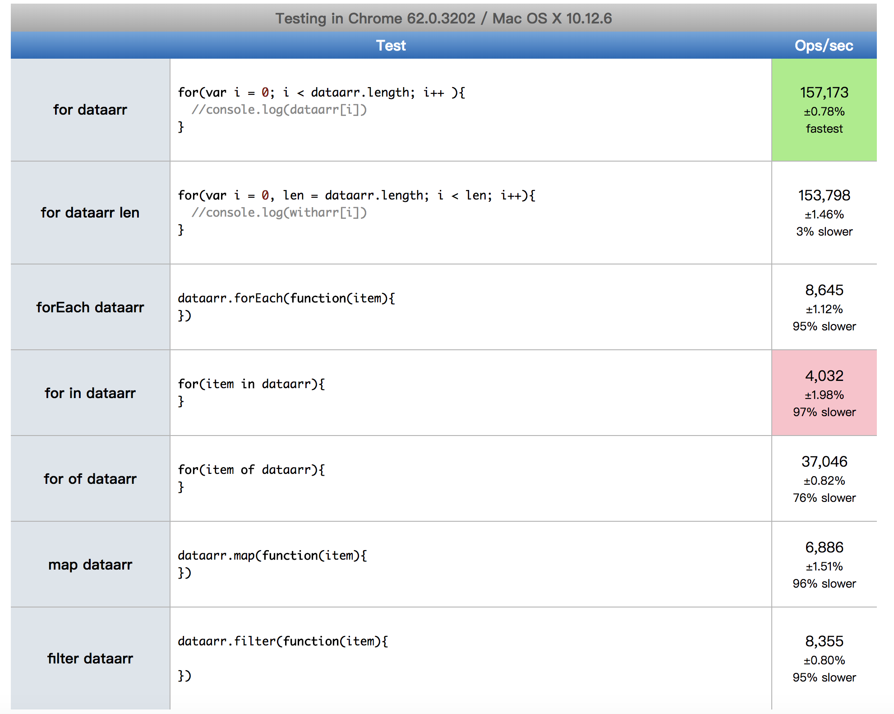
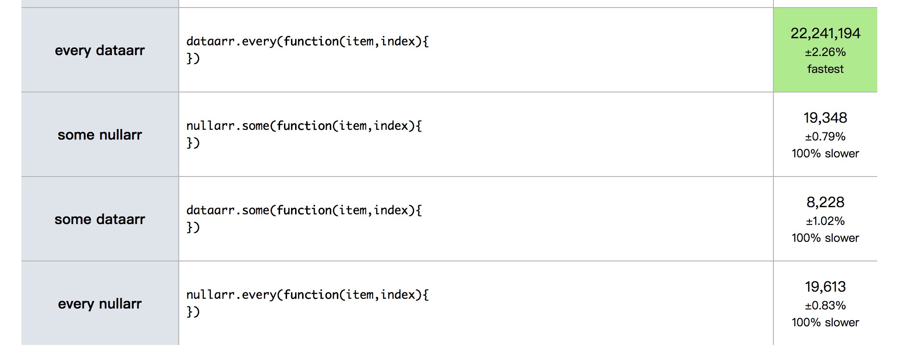
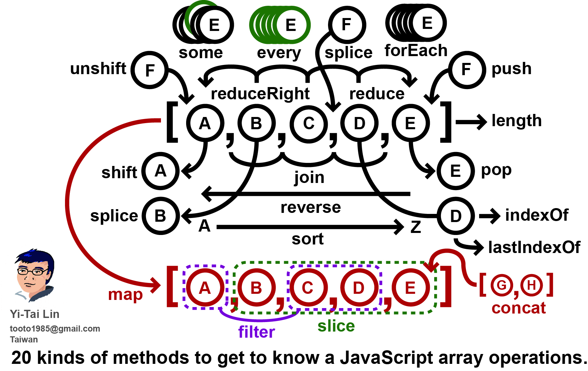

## 前言

JavaScript 发展至今已经发展出多种数组的循环遍历的方法,不同的遍历方法运行起来那个比较快,不同循环方法使用在那些场景,下面将进行比较:

<!-- more -->

## 各种数组遍历的方法

### **`for`** 语句

代码:
```javascript
var arr = [1,2,4,6]
for(var i = 0, len = arr.length; i < len; i++){
    console.log(arr[i])
}
```
这是标准for循环的写法也是最传统的语句，字符串也支持，定义一个变量i作为索引，以跟踪访问的位置，len是数组的长度，条件就是i不能超过len。 

### **`forEach`** 语句

`forEach` 方法对数组的每个元素执行一次提供的CALLBACK函数,forEach是一个数组方法，可以用来把一个函数套用在一个数组中的每个元素上，`forEach`为每个数组元素执行callback函数只可用于数组.遍历一个数组让数组每个元素做一件事情.那些已删除（使用delete方法等情况）或者未初始化的项将被跳过（但不包括那些值为 undefined 的项）（例如在稀疏数组上)；不像map() 或者reduce() ，它总是返回 undefined值，并且不可链式调用。典型用例是在一个链的最后执行副作用。

代码:
```javascript
var arr = [1,5,8,9]
arr.forEach(function(item) {
    console.log(item);
})
```

### **`for-in`** 语句
一般会使用`for-in`来遍历对象的属性的,不过属性需要 **`enumerable`**,才能被读取到.
`for-in` 循环只遍历可枚举属性。一般常用来遍历对象，包括非整数类型的名称和继承的那些原型链上面的属性也能被遍历。像 Array和 Object使用内置构造函数所创建的对象都会继承自Object.prototype和String.prototype的不可枚举属性就不能遍历了.


代码:
```javascript
var obj = {
    name: 'test',
    color: 'red',
    day: 'sunday',
    number: 5
}
for (var key in obj) {
    console.log(obj[key])
}
```

### **`for-of`** 语句 (ES 6)
`for-of`语句在可迭代对象（包括 Array，Map，Set，String，TypedArray，arguments 对象等等）上创建一个迭代循环，调用自定义迭代钩子，并为每个不同属性的值执行语句。只要是一个iterable的对象,就可以通过`for-of`来迭代.


代码:
```javascript
var arr = [{name:'bb'},5,'test']
for (item of arr) {
    console.log(item)
}
```

### `for-of` 和 `for-in` 的区别

`for-in` 语句以原始插入顺序迭代对象的可枚举属性。`for-in`会把继承链的对象属性都会遍历一遍,所以会更花时间.

`for-of` 语句只遍历可迭代对象的数据。


## Other 循环方法

### **`map`** 方法 (不改变原数组)
`map` 方法会给原数组中的每个元素都按顺序调用一次  callback 函数。callback 每次执行后的返回值（包括 undefined）组合起来形成一个新数组。 callback 函数只会在有值的索引上被调用；那些从来没被赋过值或者使用 delete 删除的索引则不会被调用。让数组通过某种计算产生一个新数组,影射成一个新的数组,

代码:
```javascript
var arr = [1,2,3]
var firearr = arr.map(current => current * 5)
```

### **`reduce`** 方法 
让数组中的前项和后项做某种计算,并累计最终值,

代码:
```javascript
var wallets = [4,7.8,3]
var totalMoney = wallets.reduce( function (countedMoney, wallet) {
    return countedMoney + wallet.money;
}, 0)
```

### **`filter`** 方法 (不改变原数组)
`filter` 为数组中的每个元素调用一次 callback 函数，并利用所有使得 callback 返回 true 或 等价于 true 的值 的元素创建一个新数组。callback 只会在已经赋值的索引上被调用，对于那些已经被删除或者从未被赋值的索引不会被调用。那些没有通过 callback 测试的元素会被跳过，不会被包含在新数组中。筛选出过滤出数组中符合条件的项,组成新数组.

代码:
```javascript
var arr = [2,3,4,5,6]
var morearr = arr.filter(function (number) {
    return number > 3
})
```

### **`every`** 方法
every 方法为数组中的每个元素执行一次 callback 函数，直到它找到一个使 callback 返回 false（表示可转换为布尔值 false 的值）的元素。如果发现了一个这样的元素，every 方法将会立即返回 false。否则，callback 为每一个元素返回 true，every 就会返回 true。检测数组中的每一项是否符合条件,如果每一项都符合条件,就会返回true,否则返回false,有点像遍历数组且操作callback。只会为那些已经被赋值的索引调用。不会为那些被删除或从来没被赋值的索引调用。


代码:
```javascript
var arr = [1,2,3,4,5]
var result = arr.every(function (item, index) {
    return item > 0
})
```

### **`some`** 方法

some 为数组中的每一个元素执行一次 callback 函数，直到找到一个使得 callback 返回一个“真值”（即可转换为布尔值 true 的值）。如果找到了这样一个值，some 将会立即返回 true。否则，some 返回 false。callback 只会在那些”有值“的索引上被调用，不会在那些被删除或从来未被赋值的索引上调用。检查数组中是否有某些项符号条件,如果有一项就返回true,否则返回false,有点像遍历数组或者操作.

代码:
```javascript
var arr = [1,2,3,4,5]
var result = arr.some(function (item,index) {
    return item > 3
})
```

## 对比遍历速度

对比这里我使用了[jsPerf平台](https://jsperf.com/)进行测试.

### JavaScritp loop 对比

我创建了两个数组进行对比,为什么要这样区别呢,因为不同类型的数组在javascript内存中保存的地址格式不一样,遍历的时候编辑器会根椐数组元素的类型长度计算,比如说如果数组里面全是Number类的,循环起来会比数组里面包含Number,String,Object混合型的会快,所以创建了两个数组,一个是全undefined数组,一个是混合型数组.

```javascript
// 一个是空数组
var nullarr = new Array(10000) // [undefined,undefined,...undefined]

// 另一个带不同类型的数据的数组
var dataarr = []
for(var i = 0; i < 10000; i++){
    if (i % 2 ===0) {
        dataarr[i] = i.toString()
    } else {
        dataarr[i = i
    }
}
dataarr // [1,'2',3...,10000]
```

测试后发现有点奇怪直接检索空数组还是会比数据数组慢这是为什么呢奇怪?为了对比循环的一致性我只选其中带数据的数组`dataarr`进行测试.

那我们对比一下 `for` `for len` `forEach` `for-in` `for-of` `map` `filter` 循环的速度




可以看到 `for`循环的速度是最快的,是最老的循环,也是优化得最好的,其次是`for-of`这个是es6才新增的循环非常好用,最慢是`for-in`我们可以作一下速度排序

> `for` > `for-of` > `forEach` > `filter` > `map` > `for-in` 

这很明显处理大量循环数据的时候还是要使用古老`for`循环效率最好,但也不是不使用`for-in`,其实很多时候都要根据实际应该场景的,`for-in`更多使用在遍历对象属性上面,`for-in`在遍历的过程中还会遍历继承链,所以这就是它效率比较慢的原因,比如`map` 速率不高,不过处理在Es6实现数组功能上面非常好用方便,轻松影射创建新数组.或者例如使用[**Iterator**](http://es6.ruanyifeng.com/#docs/iterator)属性也是行的,所以每个循环都有合适使用的地方.


### `every` 和 `some` 不完全属于数组操作方法
`every` 和 `some` 都是判断条件直接返回整个数组Boolean类型的方法.`every`速度会比`some`快很多.


### 干货
一张图展示JavaScript数组方法 



### 最后
最后不同浏览器内核我相信会有些许差别,有兴趣的朋友可以去测试一下,有任何问题欢迎给博主留言.


附上测试的 [地址](https://jsperf.com/js-loop-compare/1)

## 延伸阅读
1. 迭代器(iterator) [地址](https://github.com/sunyongjian/blog/issues/18)
2. JS几种数组遍历方式以及性能分析对比 [地址](https://dailc.github.io/2016/11/25/baseKnowlenge_javascript_jsarrayGoThrough)
3. 如何形象地解释 JavaScript 中 map、foreach、reduce 间的区别？ [地址](https://www.zhihu.com/question/24927450)
4. For-each over an array in JavaScript? [地址](https://stackoverflow.com/questions/9329446/for-each-over-an-array-in-javascript)
5. JavaScript for循环性能比较 [地址](http://blog.mingsixue.com/it/JS-for-performance-compare.html)