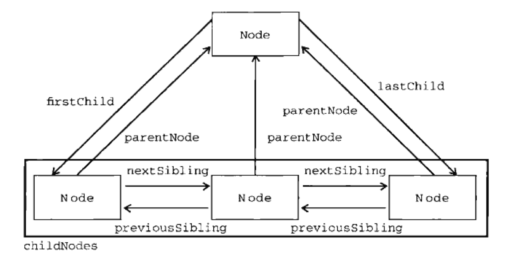

# Node 类型

Node的类型老是不记得，整理一下以便记忆,注意下面序号也是代表对应的数值

1. Node.ELEMENT_NODE
2. Node.ATTRIBUTE_NODE
3. Node.TEXT_NODE
4. Node.CDATA_SECTION_NODE
5. Node.ENTITY_REFERENCE_NODE
6. Node.ENTITY_NODE
7. Node.PROCESSING_INSTRUCTION_NODE
8. Node.COMMENT_NODE
9. Node.DOCUMENT_NODE
10. Node.DOCUMENT_TYPE_NODE
11. Node.DOCUMENT_FRAGMENT_NODE
12. Node.NOTATION_NODE

<!-- more -->

# 类型判断

如果要判断一个类型可以使用以下方法

```javascript
if (someNode.nodeType == Node.ELEMENT_NODE) {
  alert("Node is an element.");
}
```

不过由于在IE中不兼容可以使用数字判断如下：

```javascript
if (someNode.nodeType == 1) {
  alert("Node is an element.");
}
```

# Node节点和子节点之间的关系

如下图:


# 操作Node的方法

### `someNode.appendChild()`

添加节点到someNode 末尾

### `someNode.insertBefore()`

在某节点前插入

### `someNode.replaceChild()`

替换节点

### `someNode.removeChild()`

移除节点

### `someNode.cloneNode(true/false)`

深度复制节点
