现在做显示设备适配越来越复杂了,不单只要调试Web端设置还得要兼容手持端各尺寸的手持端设备,当然还有越来越广泛的生态应用 PWA SPA 等,都是在展示的网页都成App形式存在了,不在像以前的网页简单的页面与后台反馈.
所以前端也需要一个优秀的工具来测量调试. Chrome Devtools 应运而生, Chrome Devtools 提供了强大的调试测量功能,下面我们简称 Chrome 开发者工具, Chrome 开发者工具是一套内置在Google Chrome中Web开发和调试工具.使用开发者工具来重演，调试和剖析您的网站. 下面我们看看 Chrome 开发者工具有那些功能可以帮助到前端开发者的. 本文主要是对 Chrome 开发者工具的功能介绍，具体功能操作步骤请查看 Chrome Devtools 的使用手册，(由于Chrome 开发者工具更新得很快,看到这文章的时候可能和现在这个版本不一致,功能还是差不多的,我会尽力更新)。

<!--more-->

# 面板功能

## 元素面板

使用元素面板可以自由的操作DOM和CSS来重演网站布局和设计页面,可以检查和调整页面编辑样式,修改DOM。


### 检查和编辑页面与样式

在元素面板这里可以实时检查 HTML 和 CSS ，和编辑 DOM 非常方便。在开发者工具这里你看到有什么实时的页面问题都可以现场调，现场试不过一般都是临时更改，如果你想更改过后直接影响到你开发的源文件，你需要额外的设置才能把你的调试修改直接更新到源文件。

### 检查动画

现在网站页面这么大型，通常CSS3动画过渡也非常多，开发者工具还提供动画检查器，非常之强大。
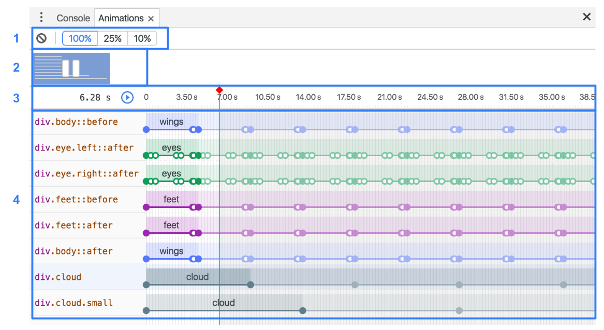

### 移动设备模拟模式

在元素面板，有一个小功能，隐藏得很深不过可以，在开发者工具这里模拟移动端设备页面和打造自适应式网站，我们看一下下图。


就是这样的一个小地方。

在这里可以设置手持端口模式，自定义窗口大小，大小屏都能模拟，屏幕反转，缩放大小都轻松模拟，当然还有地定位与加速度计，移动端传感器等，方便调试非常实用。
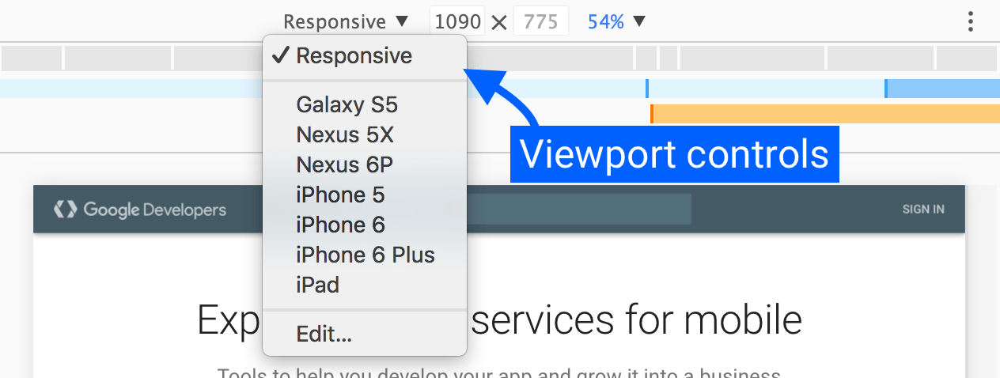

控制台日志是一种可以检查你的页面或应用所进行操作的强大方式。console.log也有很多种的操作方法。

- `console.info()` 带信息符的控制台提示
- `console.log()` 在控制台进行基本记录
- `console.error()` 在控制台进行错误记录
- `console.warn()` 在控制台进行警告
- `console.group()` `console.groupEnd()` 对控制台进行分类
- `console.groupCollapsed()` 创建一个折叠状态的记录
- `console.assert(expression, object)` 在控制台显示条件性错误消息,在代码中放置断言和引发异常
- `console.dir()` 将 DOM 元素格式化为 JavaScript 对象
- `console.dirxml()` 输出 object 元素以XML表示
- `console.table()` 将对象信息以表格形式进行显示
- `console.time()` `onsole.timeEnd()` 统计时间开始与时间结束
- `console.count()` 对执行语句进行统计
- `console.trace()` 打印当前的 JavaScript 调用堆栈
- `console.clear()` 清除控制台
- `console.debug()` 打印调试代码
- `console.profile()` `console.profileEnd()` 打印一个 JavaScript CPU 的配置文件。

### 监控事件

- monitorEvents() 监控特定的事件
- unmonitorEvents() 解除监控特定的事件
- getEventListeners() 返回指定对象上注册的事件侦听器

## 控制台面板

在开发期间，可以使用控制台面板记录诊断信息，或者使用它作为 shell在页面上与JavaScript交互,并测试 JavaScript 的运行情况, 模拟实际网页变量环境都是很不错的。
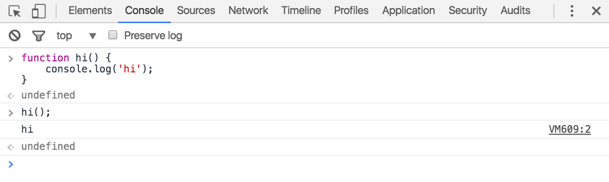

## 源代码面板

在源代码面板中设置断点来调试 JavaScript ,可以跟踪 JavaScript 源码的运行情况,可以编写小代码来测试网站源码, 可以通过Workspaces（工作区）连接本地文件来使用开发者工具的实时编辑器, 把调试结果直接保存到代码中非常强大。
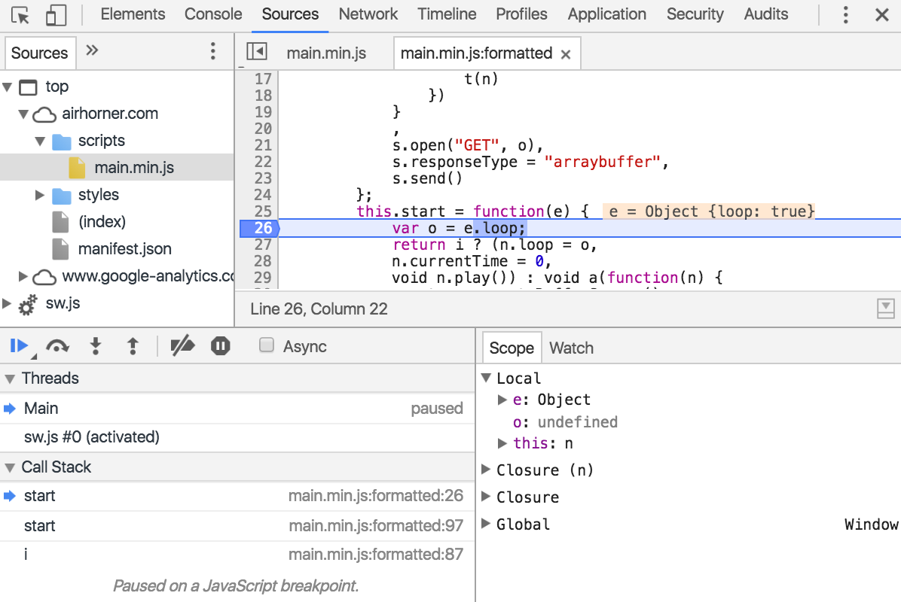

在源代码面板，可以使用断点暂停代码，重现错误，跟IDE的断点调试一样，可以逐步调试，查看变量与逻辑是否正确。

### 查看网络文件

你可以在源代码面板上面查看被加载的源文件，你点击里面的 Network 面板可以查看各加截到网站的 js 文件和其它文件。
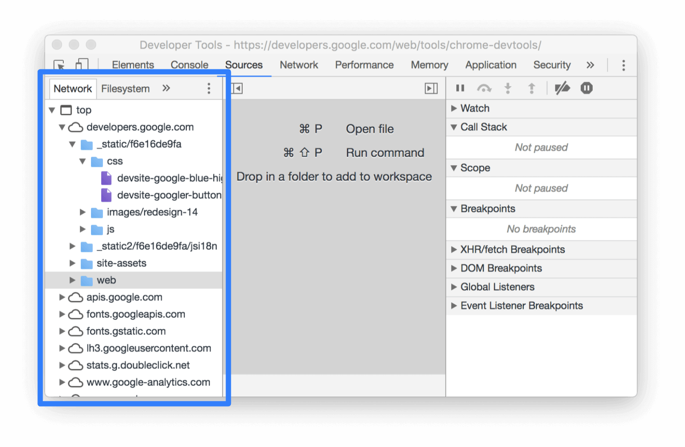

### 运行代码段

代码段是您可以在 Chrome DevTools 的 Sources 面板中制作和执行的小脚本。 您可以从任何页面访问和运行它们。 在您运行代码段时，它会从当前已打开页面的上下文执行。代码段可以实现很多功能比如加载其它js检测页面，运行代码段协助检测网页脚本。还可以设置断点检查代码运行过程。


### 编辑 CSS 和 JavaScript

可以编写现场修改 CSS 和 JavaScript, 修改CSS会立刻在网页页面生效，修改JavaScript 文件的话，你修改后得保存后再运行才会生效。你甚至可以直接在开发者工具修改直接保存在你的系统文件当中，不过直接影响你的系统文件需要[设置](https://developers.google.com/web/tools/chrome-devtools/sources?hl=zh-cn#workspace).

### 运行代码小片段

这个厉害了，可以在一个网站应用场景下面,运行代友小片段，你可以运行测试代码，检测代码，甚至任何做坏事的代码。下面就有一个小片段：

```javascript
let script = document.createElement("script");
script.src = "https://code.jquery.com/jquery-3.2.1.min.js";
script.crossOrigin = "anonymous";
script.integrity = "sha256-hwg4gsxgFZhOsEEamdOYGBf13FyQuiTwlAQgxVSNgt4=";
document.head.appendChild(script);
```

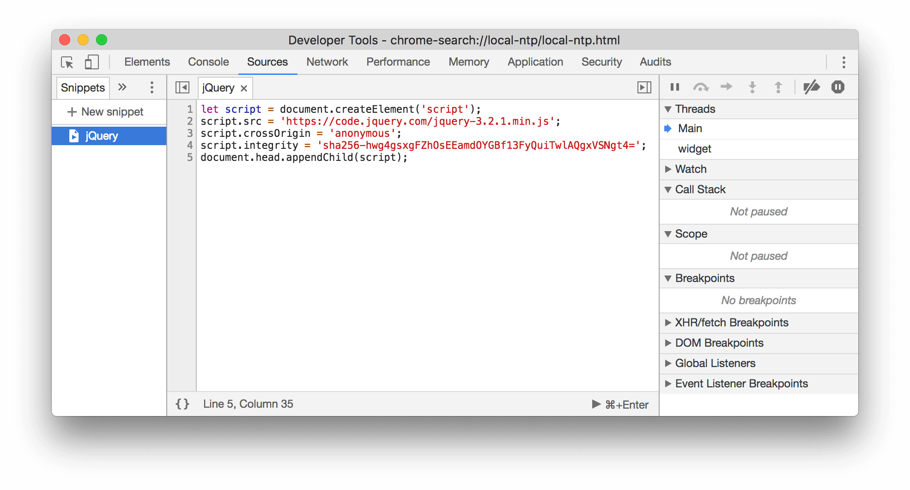
在小片段界面，添加上面这个小片段，运行后就能就能为页面添加 jQuery library 的库。

### 调试JavaScript

在源代码面板，可以断点调试 JavaScript，审查变量的值和在特定时刻所调用的堆栈。
一旦你设置了断点，你应该学习如何遍历你的代码，并审查你的变量和调用堆栈。 这可以很好地判断逻辑过程快速排错，这功能经常会使用到。

## 网络面板

使用网络面板了解请求和下载的资源文件并优化网页加载性能, 并可以了解网络访问资源情况, http请求情况评估网站的网络性能,优化加载时序和模拟不同网络情况下网站的情况。


除了网页的构建运行性能外，网络的环境和资源请求的性能也是一个很重要的指标，所以 Chrome 开发者工具这里就提供了一个网络面板， 来录制你的网站资源下载情况，来判断网络资源情况，还能查看资料加载时序，HTTP的请求情况，
和返回结果等，详细的网络资源结果。

### 可以模拟手持端网络

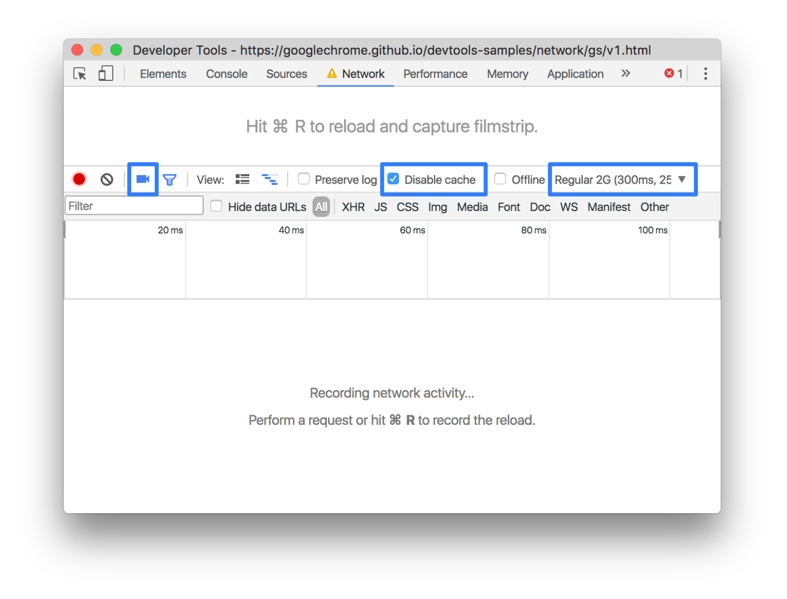

### 可以分析资源请求情况

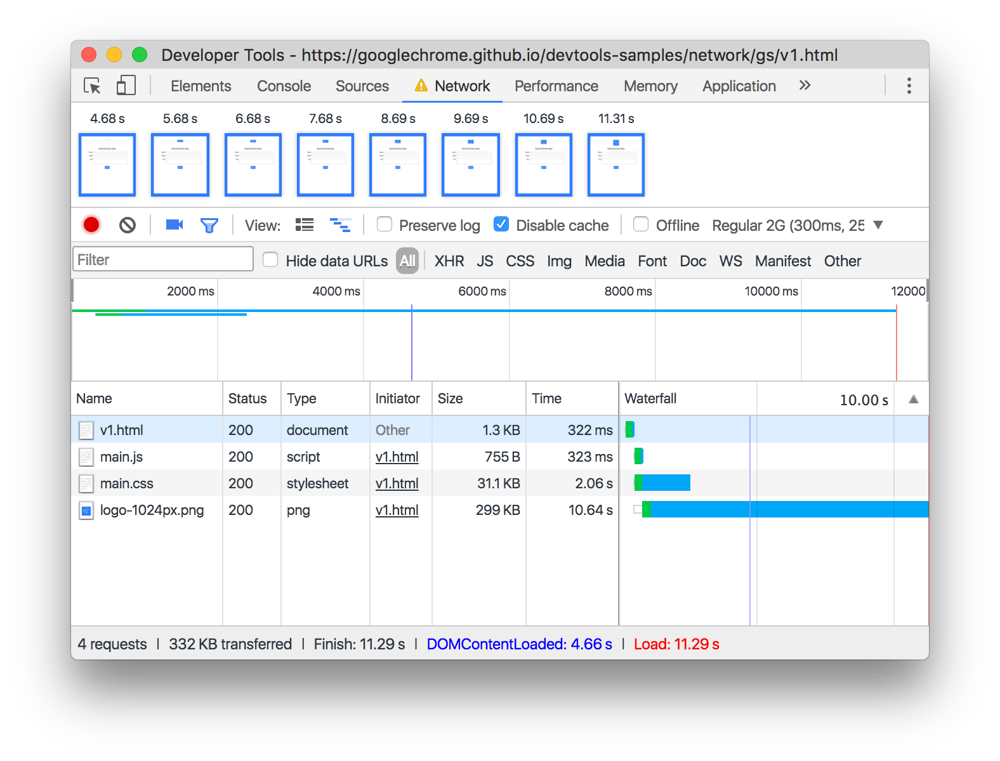

## 性能面板Performance [原：时间轴面板 Timeline]

当你的页面运行的时候，在性能面板能够统计有多少执行程序运行与加载，并且使用性能面板去分析运行性能。
使用时间轴面板可以通过记录和查看网站生命周期内发生的各种事件来提高页面的运行时性能,还能设置 Timeline 来监控某一时间的GPU FPS 等各运行情况，非常强大。
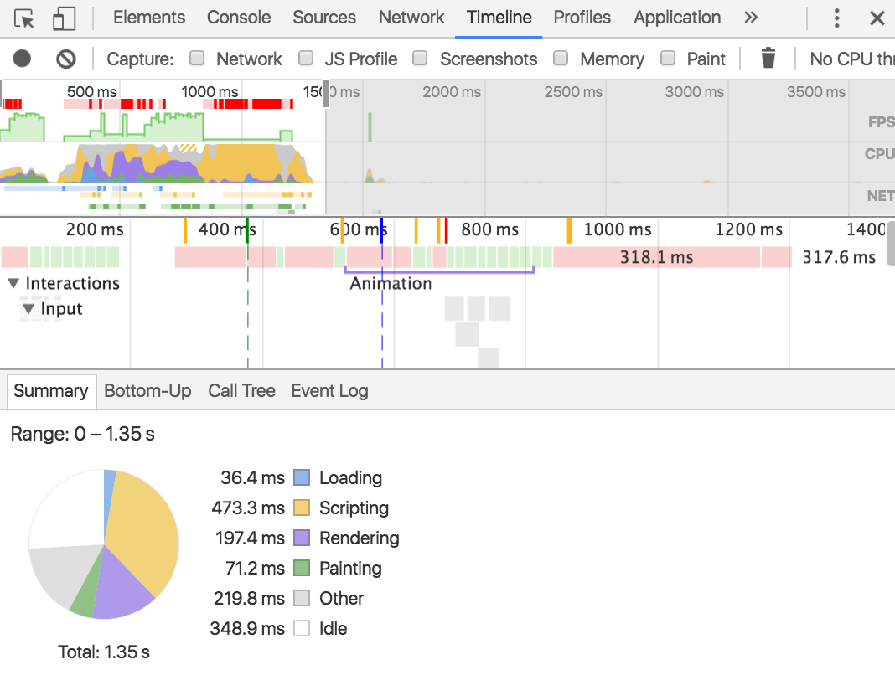

可以录制CPU分析，来查看每个函数或者渲染加载时间，chrome 开发者工具能以 火焰图查看CPU可视化情况，在火焰图中你可以很直接地看到，网站建个构建结构，CSS样式构建时间，DOM渲染时间加载时间，Script运行时间，非常方便地测量统计各时间占比，可以很好地对某些运行时间特长，或者可疑的方法进行定点，可以定点到JavaScript文件，行数及方法，进行修改或重写。

## 内存面板Memory [原：Profiles面板]

内存面板,可以录制包括内存泄漏，内存膨胀和频繁的垃圾回收情况,和 CPU 运行文件情况.


在内存面板里面，可以记录系统运行的快照

### JavaScript CPU 快照

### JavaScript 栈快照

### JavaScript 栈内存分析器

通过内存快照，可以横向或者纵向分析内存，检查DOM对象，原生对象，Script对象的构建情况，检查垃圾回收的对象情况，检查有没有内存泄露等情况。

## 应用面板

使用资源面板检查加载的所有资源，包括IndexedDB与Web SQL数据库，本地和会话存储，cookie，应用程序缓存，图像，字体和样式表。PWA 的数据保存或者 Cookies,SessionStorage,LocalStorage 等数据文件都保存在这里,包含开发者工具的后台运数据都会保存到这里.


### 调试 Progressive Web App

Application 是用来调试配置 PWA 的好地方

- **Manifest Web** 应用程序清单在一个JSON文本文件中提供有关应用程序的信息（如名称，作者，图标和描述）。manifest 的目的是将Web应用程序安装到设备的主屏幕，为用户提供更快的访问和更丰富的体验。

- **Service Workers** 是未来 web 平台的基本技术。它们是在浏览器后台运行的脚本，与网页分离。这些脚本使您可以访问功能，而不需要网页或用户交互，如推送通知，后台同步，和离线体验。

- **Cache Storage** 提供了一个已使用（服务工作线程）Cache API 缓存的只读资源列表。
- **Storage** 浏览器基本的数据存储的数据也在这里了.包括 LocalStorage SessionStorage Cookies 等。

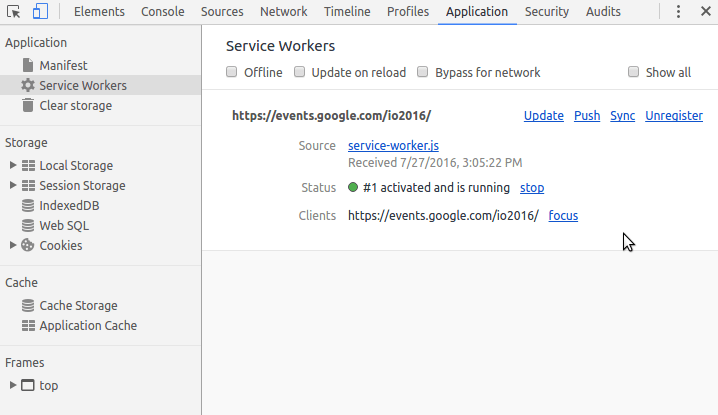

PWA 是一个将来的应用，使用户用 Web 体验原生应用.这个可以多留意一下，另外还要注意 **Storage** 因为浏览器存储的数据都要在这里找。

### 检查存储Web,数据库与缓存

Application 面板还能检查Web页面的管理存储，数据与缓存。

- **Local storage** (本地存储)
- **Session storage** (会话存储)
- **cookies**
- **IndexedDB**
- **Web SQL**
- **Application Cache**

三种主流存储地方都可以在这里，甚至还有 Web SQL等存储方式，这里可以查到在网页应用中保存的数据，可以修改保存在 Web 页面的数据，删除旧的网页数据。

## 安全面板

使用安全面板调试混入内容问题，您的证书的安全隐患及更多.
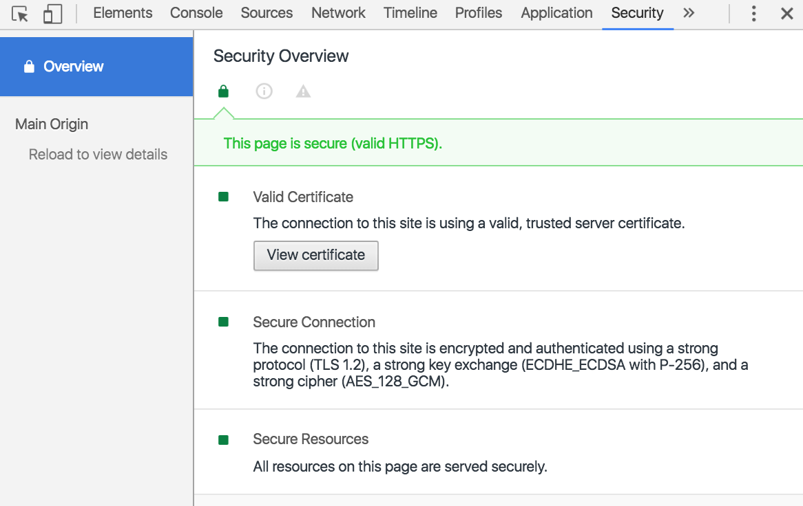

这里可以网页的安全性比如 HTTPS 并且查看各源证书的安全情况.
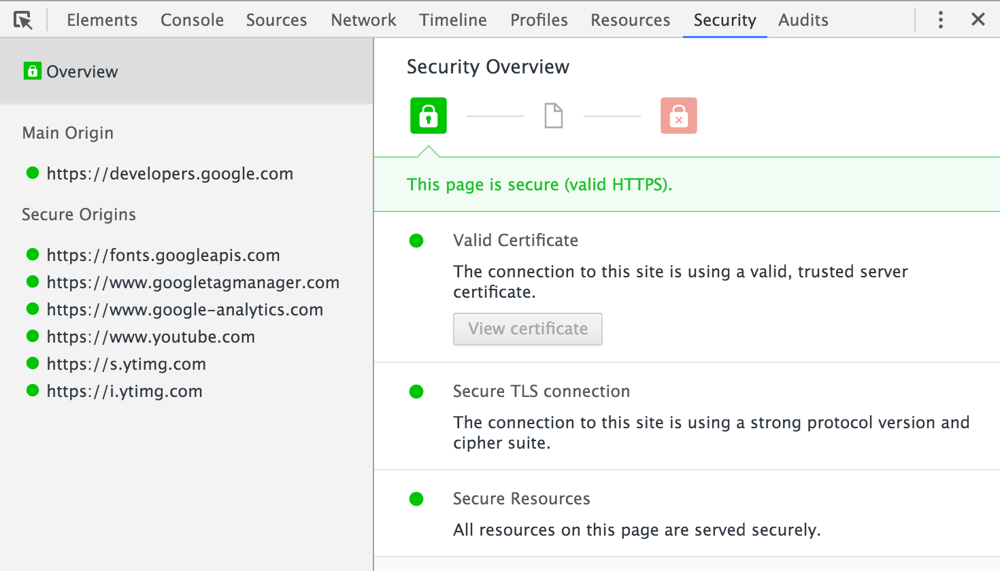
