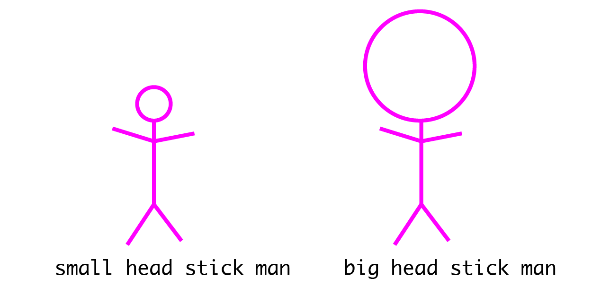
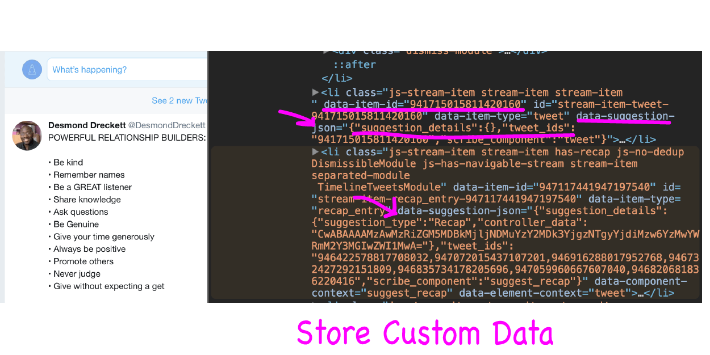

  
   
> 原文链接: [css-naming-conventions-that-will-save-you-hours-of-debugging](https://medium.freecodecamp.org/css-naming-conventions-that-will-save-you-hours-of-debugging-35cea737d849)
> 原文作者: [Ohans Emmanuel](https://medium.freecodecamp.org/@ohansemmanuel?source=post_header_lockup)
> 译者: [ClarenceC](fe2x.cc)
> 本文为意译

我已经听很多开发者说他们不喜欢CSS。在我的经验来说，造成这样的原因，不是因为要花额外的时间去学CSS。

CSS并不是一门漂亮的‘语言’，但是它也已经成功当了 Web 风格语言快20年了。感觉还还不太差啊？

然而,如果你写大量的CSS，你会很快发现一个很大的缺憾， 是非常困难地去管理维护CSS的。
写得很差的CSS很快就会变成恶梦。

这篇文章的一些命名规则会帮你一些减轻压力和省很多时间在里面。

<!-- more -->

## 用‘-’分隔符分隔字符串
如果你写过大量的JavaScript，那么写变量的时候都会习惯使用 camelcase[驼峰命名]方式。

`var redBox = document.getElementById('...')`

很好，对吗？
问题是这个方式不合适CSS。

千万不能写成这样：

```css
.redBox {
    border: 1px solid red;
}
```
应该用下面这方式代替：
```css
.red-box {
    border: 1px solid red;
}
```

这是一个非常标准的CSS命名规则，可以有很强的可读性。同时可以说，和CSS属性保持一致。

```javascript
//Correct
.some-class {
    font-weight: 10em
}
// Wrong
.some-class {
    fontWeight: 10em
}
```

## BEM 命名方式

一个团队就很容易就有不一样写 CSS 选择器的习惯，有些人用分隔符，而另一些会用 BEM 命名规则。

总的来说, CSS命名方式都是尝试去解决下面这三个问题：

1. 只要看到CSS的名字，就知道这个选择器是做什么的。
2. 只要看到CSS的名字，就知道这个选择器那里被使用到。
3. 只要看到CSS的名字，就知道这个选择器和其它选返选择器之间的关系。

你是不是看过一些 类名 写成下面这方式:

```css
.nav--secondary {
    ...
}
.nav__header {
    ...
}
```
这就是BEM命名方式了

## BEM 已经诞生5年了,我们理解一下BEM是什么。

BEM 尝试去划分全部用户接口变成可重复使用组件。
思考下面这个图：


这个火柴人代表了一个组件，就像一个模块设计。
### B 就是 Block 模块
你应该猜到在 BEM 全名规则里面 B 就是代表 ‘Block’.
在真实世界里面， ‘Block’ 通常用来代表一个网站的 navigation， header, footer 或者其它 block（块）设计元素。

按照上面解释的描述的，这个用来描述这个块的类名应该是 `stick-man`。

这个组件应该像这样描述：
```css
.stick-man {

}
```

我们在这里使用了分隔符，非常好哈。


### E 就是 Elements 元素
这个在 BEM 里面的E 就是 Elements。一般在整体的块设计当中很少单独存在的。像下面这个实例，火柴人有`head`，两个华丽的双 `arms`，和 `feet`。


这些 `head`,`feet`, 和 `arms` 全部的元素都在一个块组件里面，他们就像是子组件一样，像子组件组成大组件一样。
我们使用 BEM 命名规则的时候，元素的类名都得在下面加两个下划线 `__`,就像下面的元素名一样，例如：
```css
.stick-man__head {

}
.stick-man__arms {

}
.stick-man__feet {

}
```

### M 就是 Modifiers 修饰符
这里的 M 就是代表 BEM 里面的修饰符
如果火柴人加上修饰符我们很可能就有了一个 `blue` 和一个 `red` 的火柴人？


在实际世界当中，这很可能就变成是一个 `red` 按钮和一个 `blue` 按钮，这些就是修饰这个组件块的问题了。
在使用 BEM的时候， 要去区分修饰类名，就要添加两个分隔符 `--` 在元素后面，比如：

```css
.stick-man--blue {

}
.stick-man--red {

}
```
像上面这个例子，是表达出火柴人这个父组件的状态，不过这不是最常见的情况。
如果我们想描述火柴人有不同的 `head` 大小呢？

这次元素被更改了，记着，元素是子组件在整体 Block (块)里面。这个 `.stick-man` 代表了一个 `Block`, `.stick-man__head` 是这个的元素。
看一下下面这个例子，连接符应该像这样写:

```css
.stick-man__head--small {

}
.stick-man__head--big {

}
```
再一次注意，上面使用了分隔符 `--` 代表了修饰的状态。现在你明白了。

不过这只是基本怎样使用 BEM 命名方式工作而儿拉。

对于我个人来说，我更倾向于只用 `-` 分隔符字段名类名来做简单的命名，而 BEM 则涉及更多用户接口的时候使用。

如果你想阅读更多 BEM 资料可以看这里 [更多](http://getbem.com/naming/) 

### 为什么要用到命名规则

> 计算机科学有两大难题：内存失效和命名对象 - Phil Karlton

命名一个对象是非常难的。 我们尝试去另到命名变得更简单，同时在将来维护代码的时候不需要花费太多时间。命名规则如果正确使用在CSS上面，就会使到你的代码更容易去阅读和维护。

如果你选择用 BEM 命名规则，这会让 CSS 更容易看清组件块之间的关系。是不是感觉不错？

### 在 JavaScript 钩子上的 CSS 名称
今天， John 第一日上班。他提交了 `HTML` 代码像下面这样：

```javascript
<div class="siteNavigation">
    ...
</div>
```
John 已经看过这篇文章并认识到好的CSS命名方式，所以他继续重构代码像这：
```javascript
<div class="site-navigation">

</div>
```
看起来不错对不？但是有未知道的危险在等待着 John。
在某个 JavaScript 的代码里，有一个关联之前 Class 名，的 `siteNavigation`:

```javascript
// the Javascript code
const nav = document.querySelector('.siteNavigation')
```
因为，上面改变了 class 名，这个 nav 变量变成为 null。这是多么低落的，对于这种情况，开发者们都有不同的策略应对方案。

1. 用 `js-` 做类名
其实中一种方法是用`js-*`的类名 减少关联 DOM 元素的问题。比如：
```javascript
<div class="site-navigation js-site-navigation">

</div>
```
添加 JavaScript 代码:
```javascript
// JavaScript code
const nav = document.querySelector('.js-site-navigation')
```
正如这个命名，任何人看到 `js-site-navigation` 类名都会明白这是一个关联到 JavaScript DOM 元素的 类名。

2. 使用 `Rel` 属性
之前看过这个写法吗？
`<link rel="stylesheet" type="text/css" href="main.css">`
基本上，这个 `rel` 定义了连接资料与文档之间引用的关系。在之前 John 的例子,技术支持者会写成这样：
```javascript
<div class="site-navigation" rel="js-site-navigation">
</div>
```
在 JavaScript 那边：

`const nav = document.querySelector("[rel='js-site-navigation']")`
我对这样使用有点疑惑，但是你们喜欢跨过某些代码，也是没问题的。Web 网页是一个足够大的地方，使它可以用不同方法解决同一个问题。

3. 不要使用`data-attributes`属性
有些开发者喜欢用`data-attributes`来做 JavaScript 钩子.这是不对的。从定义上为来说，数据属性是用来存自定义数据的。



### 小贴士： 写更详细的 CSS 注释
这不需要你再做什么在命名规则上面了，但它也会另你优化 CSS 更省时间。

有一些 web 开发者他们几乎不写 JavaScript 注释，但是我觉得你还是应该多写写 CSS 注释的。
虽然 CSS 并不是一门优雅的 ‘语言’，但是好的注释构能让你快速明白你的代码。如果你们不相信的话可以看看 Bootstrap 的 [源码](https://github.com/twbs/bootstrap/blob/v4-dev/scss/_carousel.scss)多么好的注释。你不需要写那些 `color:red` 来标注一个红色标记，但是如果你用一个不明显的 CSS 技巧很快就会忘记了，所以请随意写地去写一些 CSS 注释吧。
