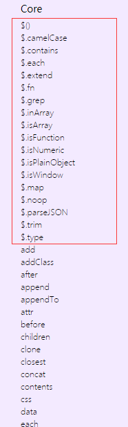
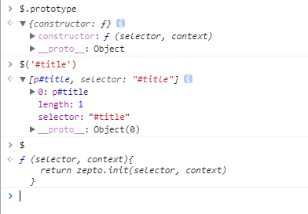
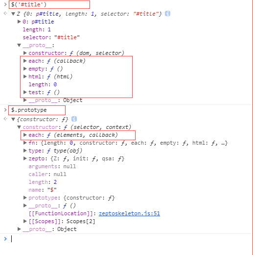
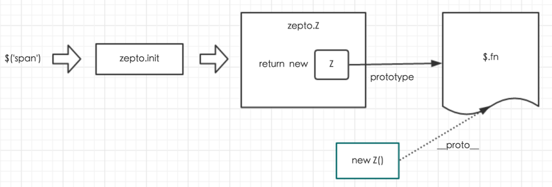

# 前言

在学习的过程中,学会阅读源码也是一种很好的过程,但是对于一个新手来说,阅读源码就像一面茫然,下载了源码不知道从何开始.这里楼主选择从Zepto源码开始学习.首先因为Zepto并不复杂,Zepto实现功能还是比较简单, Zepto是类似于Jquery的轻量库,不过作用于手机端,类似于Jquery对DOM操作进行拼接,Zepto对PC端的IE浏览器兼容并没有做得很好,需然大小比Jquery小但是也没有Jquery做得那么好.

# 阅读源码需要具备什么条件

在阅读源码时需要准备些什么,你才能读懂:

1. 在阅读源码之前你需要知道这个源码的功能和作用是什么?实现什么功能?越清楚你就越容易看懂.

2. 在阅读源码之前你需要把源码的文档,或者测试用例看一次.

3. 找到源码的入口,暴露在全局的入口.如果你找不准代码看起来就像一团乱麻,得找到线头入口.

4. 读源码的时候需要,得先把源码的代码结构先弄清楚,细节的代码逻辑再慢慢整理.

<!-- more -->

# 从*$*入口开始分析

在你细细看过Zepto 文档后,基本发现Zepto都是通过*$*使用的.*$*是什么?在网页脚本中导入后,*$*是调用Zepto的入口,我们再详细查看一下Zepto下面的方法,如下图分成了两类:



```javascript

// 一类是核心方法
$.camelCase()
// 另一类是
$('<li>new list item</li>').appendTo('ul')

```
区别在于核心方法是挂在*$*对象上面的,
另一个是挂在*$()*生成的对象上面的.


我们可以测试一下:

```html
<!DOCTYPE>
<html>
    <head>
        <script src="./zepto.js"></script>
    </head>
    <body>
        <p id="title"><title>Zepto Demo</title></p>
        <div id="ul">
            <ul>
                <li>One</li>
                <li>Two</li>
                <li>Three</li>
            </ul>
        </div>
        <div class="span"><span>Monday</span><span>Thusday</span><span>Wesday</span></div>
    </body>
</html>
```
输出一下下面代码
```javascript
console.log($.prototype);
console.log($("#title"));
console.log($);
```
你会发现这的确很大区别的


# Zepto源码结构

在引入Zepto后,*$*是一个window的一个全局变量.

## Zepto核心闭包与返回*$*

```javascript
var Zepto = (function() {
    ...
  return $
})()

...

window.Zepto = Zepto
window.$ === undefined && (window.$ = Zepto)
...
```

zepto核心其实是一个立即执行的闭包对象,通过定义为一个对象,赋值给window.*$*, 这样不会污染全局环境,防止了包里面的方法和命名冲突.

我们可以看到最后把最后把*$*返回给Zepto对象,那在Zepto立刻执行方法里面的*$*是什么呢?下面我们来一步一步实现Zepto包最简单的架构,解释*$*是什么.

继续接上代码

> 定义*$*变量,交给zepto.init方法处理细节 

```javascript
// 对全局暴露Zepto变量
var Zepto = (function() {
  // 定义$变量
  var $,

  // [NEW]定义$变量，并将具体细节交给zepto.init处理
  $ = function(selector, context){
    return zepto.init(selector, context)
  }

  // 返回变量
  return $
})()

// 把Zepto变量挂载在window
window.Zepto = Zepto
// 当$变量没有被占用的时候，为Zepto设置别名为$
```

> 添加zepto.init方法,添加zepto对象

```javascript
// 对全局暴露Zepto变量
var Zepto = (function() {

  // 定义$变量
  var $,
  // [NEW] 初始化zepto变量为对象
    zepto = {}

  // [NEW] 添加初始化方法。当selector参数为空时，则交给zepto.Z()处理
  //        当selector为字符串时则把zepto.qsa(document, selector)的值存到dom变量
  //        并且交给zepto.Z(dom, selector)处理
  //        在源码中 zepto.init是一个过滤方法判断传入$()里面是什么参数,源码里面会有各种判断然后导入各种方法创建DOM
  //        我们的简包里面只是简单判断字符型或者qsa类型

  zepto.init = function(selector, context) {
    var dom
    if (!selector) return zepto.Z()
    else if (typeof selector == 'string') {
      dom = zepto.qsa(document, selector)
    }
    return zepto.Z(dom, selector)
  }

  // 定义$变量，并将具体细节交给zepto.init处理
  $ = function(selector, context){
    return zepto.init(selector, context)
  }

  // 返回变量
  return $
})()

// 把Zepto变量挂载在window
window.Zepto = Zepto
// 当$变量没有被占用的时候，为Zepto设置别名为$
window.$ === undefined && (window.$ = Zepto)
```

> 添加Zepto.Z 处理dom

```javascript
// 对全局暴露Zepto变量
var Zepto = (function() {

  // 定义$变量
  var $,
  //        初始化zepto变量为对象
    zepto = {}

  // [NEW] 开始正式处理数据。当dom长度为0则不添加内容，
  //        否则逐个将dom数组转换为实例数组
  function Z(dom, selector) {
    var i, len = dom ? dom.length : 0
    for (i = 0; i < len; i++) this[i] = dom[i]
    this.length = len
    this.selector = selector || ''
  }

  // [NEW] 直接返回一个新的构造函数
  zepto.Z = function(dom, selector) {
    return new Z(dom, selector)
  }

  //        添加初始化方法。当selector参数为空时，则交给zepto.Z()处理
  //        当selector为字符串时则把zepto.qsa(document, selector)的值存到dom变量
  //        并且交给zepto.Z(dom, selector)处理
  //        在源码中 zepto.init是一个过滤方法判断传入$()里面是什么参数,源码里面会有各种判断然后导入各种方法创建DOM
  //        我们的简包里面只是简单判断字符型或者使用querySelectorAll类型


  zepto.init = function(selector, context) {
    var dom
    if (!selector) return zepto.Z()
    else if (typeof selector == 'string') {
      dom = zepto.qsa(document, selector)
    }
    return zepto.Z(dom, selector)
  }

  // 定义$变量，并将具体细节交给zepto.init处理
  $ = function(selector, context){
    return zepto.init(selector, context)
  }

  // [NEW]使用querySelectorAll(selector)查询DOM
  zepto.qsa = function(element, selector){
    return selector ? element.querySelectorAll(selector) : []
  }

  // 返回变量
  return $
})()

// 把Zepto变量挂载在window
window.Zepto = Zepto
// 当$变量没有被占用的时候，为Zepto设置别名为$
window.$ === undefined && (window.$ = Zepto)
```

> 现在基本成型了,接下来我们要在$的构造方法上面添加方法

```javascript
  // 定义$变量
  var $,
  //        初始化zepto变量为对象
    zepto = {}
    class2type = {}, // [NEW]添加类型对像
    emptyArray =[]   // [NEW]添加空数组


  //        开始正式处理数据。当dom长度为0则不添加内容，
  //        否则逐个将dom数组转换为实例数组
  function Z(dom, selector) {
    var i, len = dom ? dom.length : 0
    for (i = 0; i < len; i++) this[i] = dom[i]
    this.length = len
    this.selector = selector || ''
  }

      // [NEW]返回类型,判断对象类型
    function type(obj) {
        return obj ==null ? String(obj) :
          class2type[toString.call(obj)] || "object"
    }

    // [NEW]判断是不是window 对象
    function isWindow(obj)  { return obj != null && obj == obj.window }

    // [NEW]判断是否数组
    function likeArray(obj) {
        var length = !!obj && 'length' in obj && obj.length,
            type = $.type(obj)
        
        return 'function' != type && !isWindow(obj) && (
            'array' == type || length === 0 ||
             (typeof length == 'number' && length > 0 && (length -1) in obj)
        )
    }

  //        直接返回一个新的构造函数
  zepto.Z = function(dom, selector) {
    return new Z(dom, selector)
  }


  //        添加初始化方法。当selector参数为空时，则交给zepto.Z()处理
  //        当selector为字符串时则把zepto.qsa(document, selector)的值存到dom变量
  //        并且交给zepto.Z(dom, selector)处理
  //        在源码中 zepto.init是一个过滤方法判断传入$()里面是什么参数,源码里面会有各种判断然后导入各种方法创建DOM
  //        我们的简包里面只是简单判断字符型或者使用querySelectorAll类型
  zepto.init = function(selector, context) {
    var dom
    if (!selector) return zepto.Z()
    else if (typeof selector == 'string') {
      dom = zepto.qsa(document, selector)
    }
    return zepto.Z(dom, selector)
  }

  // 定义$变量，并将具体细节交给zepto.init处理
  $ = function(selector, context){
    return zepto.init(selector, context)
  }

  // [NEW]给$添加type类型方法
  $.type = type

  // [NEW]把each 方法绑定在$上面的方法
  $.each = function(elements, callback){
        var i, key
        if (likeArray(elements)) {
            for (i = 0; i < elements.length; i++)
                if (callback.call(elements[i], i, elements[i]) === false) return elements
        } else {
            for (key in elements)
                if (callback.call(elements[key], key, elements[key]) === false) return elements
        }
        return elements
    }

  // 使用querySelectorAll(selector)查询DOM
  zepto.qsa = function(element, selector){
    return selector ? element.querySelectorAll(selector) : []
  }

  // 返回变量
  return $
})()

// 把Zepto变量挂载在window
window.Zepto = Zepto
// 当$变量没有被占用的时候，为Zepto设置别名为$
window.$ === undefined && (window.$ = Zepto)

```

> 添加原型链上的方法

```javascript

  // 定义$变量
  var $,
  //        初始化zepto变量为对象
    zepto = {}
    class2type = {}, // 添加类型对像
    emptyArray =[]   // 添加空数组


  //        开始正式处理数据。当dom长度为0则不添加内容，
  //        否则逐个将dom数组转换为实例数组
  function Z(dom, selector) {
    var i, len = dom ? dom.length : 0
    for (i = 0; i < len; i++) this[i] = dom[i]
    this.length = len
    this.selector = selector || ''
  }

      // 返回类型,判断对象类型
    function type(obj) {
        return obj ==null ? String(obj) :
          class2type[toString.call(obj)] || "object"
    }

    // 判断是不是window 对象
    function isWindow(obj)  { return obj != null && obj == obj.window }

    // 判断是否数组
    function likeArray(obj) {
        var length = !!obj && 'length' in obj && obj.length,
            type = $.type(obj)
        
        return 'function' != type && !isWindow(obj) && (
            'array' == type || length === 0 ||
             (typeof length == 'number' && length > 0 && (length -1) in obj)
        )
    }

  //        直接返回一个新的构造函数
  zepto.Z = function(dom, selector) {
    return new Z(dom, selector)
  }


  //        添加初始化方法。当selector参数为空时，则交给zepto.Z()处理
  //        当selector为字符串时则把zepto.qsa(document, selector)的值存到dom变量
  //        并且交给zepto.Z(dom, selector)处理
  //        在源码中 zepto.init是一个过滤方法判断传入$()里面是什么参数,源码里面会有各种判断然后导入各种方法创建DOM
  //        我们的简包里面只是简单判断字符型或者使用querySelectorAll类型
  zepto.init = function(selector, context) {
    var dom
    if (!selector) return zepto.Z()
    else if (typeof selector == 'string') {
      dom = zepto.qsa(document, selector)
    }
    return zepto.Z(dom, selector)
  }

  // 定义$变量，并将具体细节交给zepto.init处理
  $ = function(selector, context){
    return zepto.init(selector, context)
  }

  // 给$添加type类型方法
  $.type = type

  // 把each 方法绑定在$上面的方法
  $.each = function(elements, callback){
        var i, key
        if (likeArray(elements)) {
            for (i = 0; i < elements.length; i++)
                if (callback.call(elements[i], i, elements[i]) === false) return elements
        } else {
            for (key in elements)
                if (callback.call(elements[key], key, elements[key]) === false) return elements
        }
        return elements
    }

  // [NEW]在原型链上面添加方法
  $.fn = {
        constructor: zepto.Z,
        length: 0,
        each: function(callback){
            emptyArray.every.call(this, function(el, idx){
                return callback.call(el, idx, el) !== false
            })
            return this
        },
        empty: function(){
            return this.each(function(){ this.innerHTML = '' })
        },
        html: function(html){
            return 0 in arguments ?
              this.each(function(idx){
                  var originHtml = this.innerHTML
                  $(this).empty().append( funcArg(this, html, idx, originHtml) )
              }) : 
              (0 in this ? this[0].innerHTML : null)
        },
        test: function(){
            return this.each(function(){
                console.log('Test Function');
                return this
            })
        }
  }

  // 使用querySelectorAll(selector)查询DOM
  zepto.qsa = function(element, selector){
    return selector ? element.querySelectorAll(selector) : []
  }

  // [NEW] 原型链指向$.fn
  // $.fn对象赋值给Z.prototype Z实例继承$.fn 对象的方法
  // zepto.Z 又继承自$.fn
  zepto.Z.prototype = Z.prototype = $.fn
  
  // [NEW]$.zepto指向zepto
  $.zepto = zepto

  // 返回变量
  return $
})()

// 把Zepto变量挂载在window
window.Zepto = Zepto
// 当$变量没有被占用的时候，为Zepto设置别名为$
window.$ === undefined && (window.$ = Zepto)
```

最后我们这里添加了原型链方法,each empty html test,都是定义在`$.fn`上面.当你调用`$()`生成DOM之后会返回一个Z对象,就是在`Z.prototype = $.fn`将`$.fn`继承到Z对象上面的.
然之前定义的`$.each()`是定义在`$`核心构造方法上面的,两个调用的方式也不一样.

在`Z.prototype = $.fn`继承后,为什么还要`zepto.Z.prototype = Z.prototype`呢?

如果我们再看源码，会发现有这样的一个方法：
```javascript
zepto.isZ = function(object) {
  return object instanceof zepto.Z
}
```

这个方法是用来判读一个对象是否为 zepto 对象，这是通过判断这个对象是否为 zepto.Z 的实例来完成的，因此需要将 zepto.Z 和 Z 的 prototype 指向同一个对象。 isZ 方法会在 init 中用到。


现在可以把自己创造的zepto包导入到自己定义的网页当中.你会注意到刚才自己定义的方法已经可以使用了.



测试一下,没问题了.

`$('#test').test()`

下面看一下zepto结构的图: [转至wangfupeng博客图](https://www.kancloud.cn/wangfupeng/zepto-design-srouce/173692)



在清楚大概程序答建结构后,就可以细看分支了,可以细看每一个方法是怎样实现的.

# 细节实现
当你观看细节方法功能实现的时候,看到的是不一样的东西,比如是JavaScript数组的处理,全局window对象的判断,原生JavaScript方法操作等,学到的东西是不一样的,值得细细学习,不过细节方法实现我不一一详解了,我看到另一作者写得很详细的,如果有兴趣的读者可以深入研究一下,下面给出相关作者连接:

>作者 **yeyuqiudeng**
读 Zepto 源码，分析 Zepto 源码 [连接](https://github.com/yeyuqiudeng/reading-zepto)


# 参考连接

1. Zepto源码分析（一）核心代码分析 [地址](https://segmentfault.com/a/1190000010860789)
2. 读Zepto源码之代码结构 [地址](http://www.jianshu.com/p/c607811d86cf)
3. zepto对象思想与源码分析 [地址](https://www.kancloud.cn/wangfupeng/zepto-design-srouce/173691)
4. zepto源码中关于`zepto.Z.prototype = $.fn`的问题 [地址](https://segmentfault.com/q/1010000005782663)
5. zepto源码分析-代码结构[地址](https://segmentfault.com/a/1190000007515865)