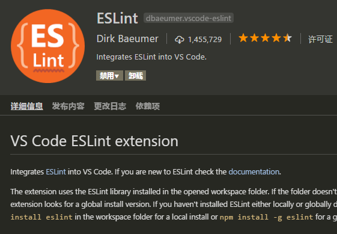
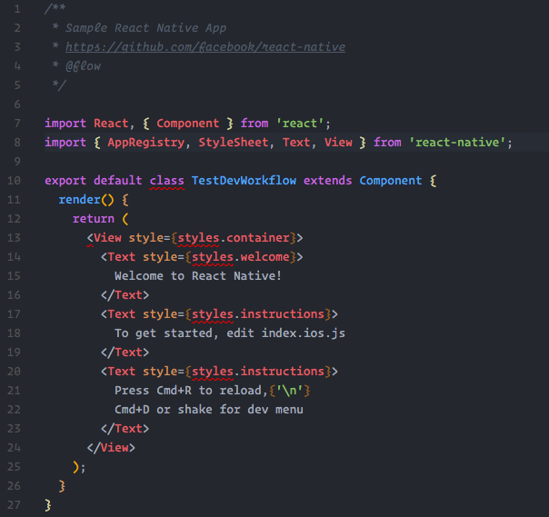
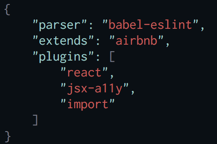
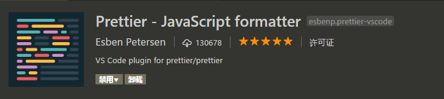

在项目里面一般会添加 **ESLint** 来对代码进行规范和验证,当项目里面添加 **ESLint**（怎样添加） 代码规范后，项目运行时就会检查并提示各种格式问题。
在VSCode中,可以直接在插件里面添加到你的VSCode中.


<!-- more -->
## ESLint Linter

ESLint 直接在插件安装搜索安装就行。




在ESLint安装之后它会告诉你代码里面那些格式存在问题，如下图，



这只是最简单的验证格式提示,验证可以自定义规范,也可以引入一些大公司的比如Airbnb, 可以根据官网的教程 或者 阮老师的教程来调整Lint工具的语法风格.


设置Airbnb格式规范


下面提供一下配置ESLint的网址"
- ESLint官网[地址](http://eslint.cn/docs/user-guide/configuring)
- 阮一峰老师教程[地址](http://javascript.ruanyifeng.com/tool/lint.html)

ESLint会验证你的 代码语法,并且提示错误在编译端,但不会帮你修证你的代码.不过你也可以通过ESLint 的 fix命令提供修复.

ESLint 也可以自动修复格式不过需要添加配置
添加 ` -fix `命令可以参考官网
[http://eslint.cn/docs/issue/autofixing](http://eslint.cn/docs/issue/autofixing)

而Prettier-JavaScript 插件会提供你的代码修复规范功能.下面介绍一下Prettier


## Prettier-JavaScript formatter 插件


使用Prettier-JavaScript 的时候,需要在VSCode 插件里面安装一下.


那安装后怎样使用呢?使用快捷键(CMD + Shift + P)
```
1.CMD + Shift + P -> Format Document
or
2.CMD + Shift + P -> Format Selection

```
之后就会自动更正代码格式规范,这样可以省去很多调整代码规范的时间.

### 关于Prettier-JavaScript 设置

添加**Prettier-JavaScript formatter** 后，需要自定义一些样式，比如:

  单引号 替换 双引号 `"prettier.singleQuote": true,`

  属性后添加逗号等 `"prettier.trailingComma": "all"`

  - 其它设置 [地址](https://marketplace.visualstudio.com/items?itemName=esbenp.prettier-vscode)

**[更新20180104]**

### 更新内容
现在Prettier 越来越高大上了,不单升级了[网站](https://prettier.io/docs/en/index.html),还升级了功能,Prettier越来越能很智能化地帮助你美化代码.

### 新增到项目的安装方式
```javascript
\\ yarn
yarn add prettier --dev --exact
# or globally
yarn global add prettier
or
\\ npm
npm install --save-dev --save-exact prettier
# or globally
npm install --global prettier
```

### 配置方式也多了很多(写几个比较有用的配置)

#### Semicolons(分号)

默认: true

**true**: 每行语句后面都自动添加分号

**false**: 只在最开始一行添加分号

#### Quotes引号
默认: false

`singleQuote: true` 开启单引号

`singleQuote: false` 关闭单引号

#### Trailing Commas (跟随的逗号)

`trailingComma : <none|es5|all>`

默认: none 没有跟随的逗号

`es5 ` 逗号在ES5中(Object, arrays, etc) 合规的情况下添加.

`all` 逗号在全部情况下添加.包括(arguments)

#### Bracket Spacing (包围空格)

默认: true

`bracketSpacing: <bool>`

true - Example: { foo: bar }.

false - Example: {foo: bar}.


#### JSX Brackets (React JSX)

`jsxBracketSameLine: <bool>`

设置后多行后的JSX会自动变成

```javascript
  <Component
    attribute
    className
    ...
  >
    Something
  </Component>
```

#### Arrow Function Parentheses(箭头括号)

`arrowParens: "<avoid|always>"`

默认: avoid

"avoid" - 默认为空. Example: x => x

"always" - 设置后会自动添加括号. Example: (x) => x


###  Prettier 能解决哪些问题
  主要就是自动格式化代码, 强行保证项目代码的风格一致. 而且由于是自动进行格式化, 写 js 的时候也就能更早发现语法问题, 而且由程序自动进行调整, 甚至报错.